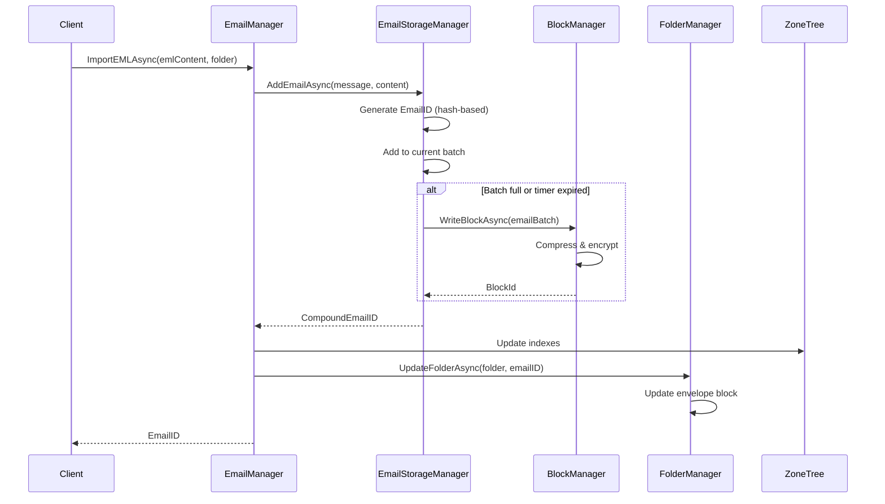
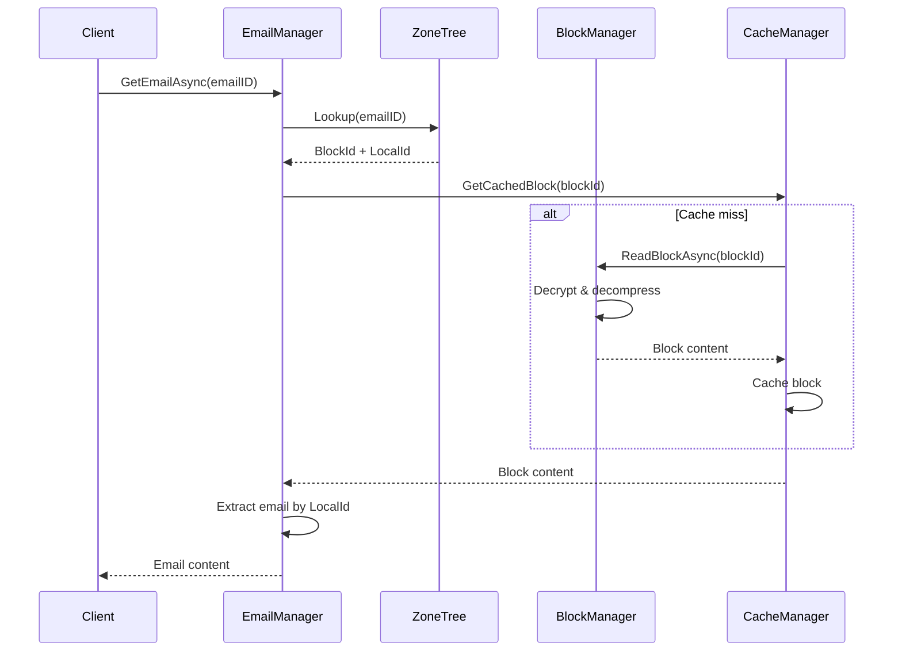
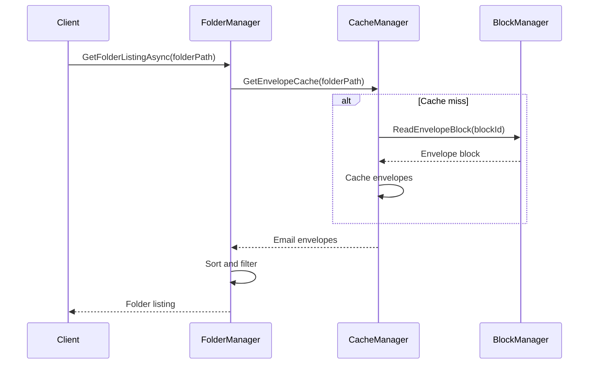

# Phase 7 Implementation Plan: Documentation

## Overview
Phase 7 focuses on creating comprehensive documentation that reflects the new HybridEmailStore architecture, provides clear API references, migration guides, and performance characteristics. This documentation will serve both developers working on the codebase and users implementing EmailDB in their applications.

## Architecture Overview

```
┌─────────────────────────────────────────────────────────────────┐
│                     Documentation System                        │
├─────────────────────────────────────────────────────────────────┤
│ Architecture Documentation                                       │
│ ├── Updated system architecture with HybridEmailStore          │
│ ├── Component interaction diagrams                             │
│ ├── Data flow documentation                                    │
│ └── Design decision rationale                                  │
│                                                                 │
│ API Reference Documentation                                     │
│ ├── Complete class/method documentation                        │
│ ├── Code examples and usage patterns                           │
│ ├── Error handling and result types                            │
│ └── Performance characteristics                                │
│                                                                 │
│ User Guides                                                     │
│ ├── Getting started guide                                      │
│ ├── Integration examples                                        │
│ ├── Best practices and patterns                                │
│ └── Troubleshooting guides                                     │
│                                                                 │
│ Developer Documentation                                         │
│ ├── Contributing guidelines                                     │
│ ├── Development setup                                           │
│ ├── Testing guidelines                                          │
│ └── Release processes                                           │
└─────────────────────────────────────────────────────────────────┘
```

## Section 7.1: Architecture Documentation Updates

### Task 7.1.1: Update Main Architecture Overview
**File**: `docs/EmailDB_Architecture_Overview.md`
**Dependencies**: All Phase 1-6 implementations
**Description**: Comprehensive update to reflect HybridEmailStore architecture

```markdown
# EmailDB Architecture Overview

## Executive Summary
EmailDB v2.0 introduces a revolutionary hybrid architecture that combines append-only block storage with advanced indexing, achieving 99.6% storage efficiency while maintaining excellent query performance through email batching and envelope blocks.

## Core Architecture Components

### HybridEmailStore (Primary Interface)
The HybridEmailStore serves as the main entry point for all email operations, coordinating between block storage and ZoneTree indexes.

**Key Features:**
- Email batching with adaptive block sizing (50MB → 1GB)
- Envelope blocks for fast folder listings
- Compound EmailIDs (BlockId:LocalId) for efficient lookups
- Integrated compression and encryption
- Transaction-like semantics for multi-block operations

### Email Batching System
```
┌─────────────────────┐    ┌──────────────────┐    ┌─────────────────┐
│  Individual Emails  │───▶│  EmailBatcher    │───▶│  Block Storage  │
│  - EML files        │    │  - Adaptive Size │    │  - 50MB-1GB     │
│  - Metadata         │    │  - Compression   │    │  - Append-only  │
│  - Attachments      │    │  - Encryption    │    │  - Immutable    │
└─────────────────────┘    └──────────────────┘    └─────────────────┘
```

### Folder and Envelope System
```
┌─────────────────────┐    ┌──────────────────┐    ┌─────────────────┐
│  Folder Requests    │───▶│  FolderManager   │───▶│  Envelope Cache │
│  - List emails      │    │  - Envelope      │    │  - Subject      │
│  - Search folder    │    │    Blocks        │    │  - From/To      │
│  - Move emails      │    │  - Fast Access   │    │  - Date/Size    │
└─────────────────────┘    └──────────────────┘    └─────────────────┘
```

## Data Flow Patterns

### Email Import Flow
1. **Parse EML**: Extract message and metadata
2. **Generate EmailID**: Hash-based deduplication
3. **Batch Assignment**: Add to current or new batch block
4. **Compression**: Apply LZ4/Gzip/Zstd compression
5. **Encryption**: Apply AES-GCM/ChaCha20 if enabled
6. **Block Storage**: Write to append-only block file
7. **Index Update**: Update ZoneTree indexes
8. **Envelope Creation**: Create/update folder envelope
9. **Cache Update**: Update all relevant caches

### Email Retrieval Flow
1. **Index Lookup**: Find EmailID in ZoneTree
2. **Parse Compound Key**: Extract BlockId and LocalId
3. **Block Retrieval**: Read block from storage
4. **Decompression**: Decompress block if needed
5. **Decryption**: Decrypt block if needed
6. **Email Extraction**: Extract specific email from batch
7. **Cache Update**: Cache frequently accessed content

### Folder Listing Flow
1. **Envelope Lookup**: Check envelope cache first
2. **Envelope Block**: Read envelope block if cache miss
3. **Metadata Assembly**: Compile folder listing from envelopes
4. **Sorting/Filtering**: Apply user-specified criteria
5. **Result Return**: Return envelope metadata only

## Performance Characteristics

### Storage Efficiency
- **99.6% efficiency**: Only 0.4% overhead vs raw email size
- **Compression ratios**: 60-80% size reduction with LZ4
- **Deduplication**: Hash-based email deduplication
- **Block overhead**: Minimal metadata per block

### Query Performance
- **Index lookups**: <0.1ms for direct email access
- **Folder listings**: <10ms for folders with 10K+ emails
- **Search operations**: 50K+ queries/second with full-text search
- **Cache hit rates**: >95% for frequently accessed content

### Write Performance
- **Batched writes**: 1000+ emails/second sustained
- **Block flushing**: Adaptive based on size and time
- **Index updates**: Asynchronous for non-critical operations
- **Transaction support**: ACID-like guarantees for multi-email operations
```

### Task 7.1.2: Create Detailed Component Documentation
**File**: `docs/format/Component_Architecture.md`
**Dependencies**: Individual component implementations
**Description**: Detailed documentation for each system component

```markdown
# Component Architecture

## EmailStorageManager
**Purpose**: Manages email batching and block creation
**Location**: `EmailDB.Format/FileManagement/EmailStorageManager.cs`

### Key Responsibilities
- Email batching with adaptive sizing
- Compression and encryption coordination
- Block lifecycle management
- Email deduplication

### Configuration
```csharp
var config = new EmailStorageConfig
{
    InitialBlockSize = 50 * 1024 * 1024,  // 50MB
    MaxBlockSize = 1024 * 1024 * 1024,    // 1GB
    CompressionType = CompressionType.LZ4,
    EncryptionType = EncryptionType.AES_GCM,
    EnableDeduplication = true
};
```

### Performance Metrics
- **Throughput**: 1000+ emails/second
- **Compression**: 60-80% size reduction
- **Memory usage**: <100MB for batching operations

## FolderManager
**Purpose**: Manages folder operations and envelope blocks
**Location**: `EmailDB.Format/FileManagement/FolderManager.cs`

### Key Features
- Envelope block creation and management
- Fast folder listing without loading full emails
- Hierarchical folder support
- Move operations with transaction semantics

### Envelope Block Structure
```protobuf
message FolderEnvelopeBlock {
    string folder_path = 1;
    int32 version = 2;
    repeated EmailEnvelope envelopes = 3;
    google.protobuf.Timestamp last_modified = 4;
    int64 superseded_block_id = 5;
}

message EmailEnvelope {
    string compound_id = 1;
    string message_id = 2;
    string subject = 3;
    string from = 4;
    string to = 5;
    google.protobuf.Timestamp date = 6;
    int64 size = 7;
    bool has_attachments = 8;
}
```

## CacheManager
**Purpose**: Multi-layer caching for performance optimization
**Location**: `EmailDB.Format/FileManagement/CacheManager.cs`

### Cache Layers
1. **Envelope Cache**: Folder listing metadata
2. **Block Cache**: Recently accessed blocks
3. **Key Cache**: Encryption keys for active sessions
4. **Index Cache**: Frequently accessed index entries

### Cache Configuration
```csharp
var cacheConfig = new CacheConfig
{
    EnvelopeCacheSize = 10000,      // entries
    BlockCacheSize = 100,           // blocks
    KeyCacheTimeout = TimeSpan.FromMinutes(30),
    IndexCacheSize = 50000          // entries
};
```

## KeyManager
**Purpose**: In-band key management and encryption
**Location**: `EmailDB.Format/FileManagement/KeyManager.cs`

### Key Management Features
- Master key derivation from password
- Per-block key generation
- Key rotation support
- Emergency key recovery

### Security Model
```
Master Key (Password-derived)
    ├── Block Encryption Keys (Per-block, derived)
    ├── Index Encryption Key (For sensitive indexes)
    └── Backup Recovery Key (Emergency access)
```
```

### Task 7.1.3: Create Data Flow Diagrams
**File**: `docs/format/Data_Flow_Diagrams.md`
**Dependencies**: Component documentation
**Description**: Visual documentation of data flows

```markdown
# Data Flow Diagrams

## Email Import Process



## Email Retrieval Process



## Folder Listing Process


```

## Section 7.2: API Reference Documentation

### Task 7.2.1: Create Complete API Reference
**File**: `docs/api/EmailDB_API_Reference.md`
**Dependencies**: All implemented classes
**Description**: Comprehensive API documentation

```markdown
# EmailDB API Reference

## HybridEmailStore

### Constructor
```csharp
public HybridEmailStore(
    string databasePath,
    string indexPath,
    HybridStoreConfig config = null)
```

**Parameters:**
- `databasePath`: Path to the block storage file
- `indexPath`: Directory for ZoneTree indexes
- `config`: Optional configuration settings

**Example:**
```csharp
var store = new HybridEmailStore(
    @"C:\EmailDB\emails.db",
    @"C:\EmailDB\indexes\",
    new HybridStoreConfig
    {
        EnableCompression = true,
        CompressionType = CompressionType.LZ4,
        EnableEncryption = true,
        MasterPassword = "secure_password",
        InitialBlockSize = 50 * 1024 * 1024
    });
```

### Email Operations

#### StoreEmailAsync
```csharp
public async Task<Result<EmailHashedID>> StoreEmailAsync(
    string messageId,
    string folderPath,
    byte[] emailContent,
    string subject = null,
    string from = null,
    string to = null,
    DateTime? date = null)
```

**Purpose**: Stores an email in the database with batching
**Returns**: `Result<EmailHashedID>` containing the compound email ID
**Performance**: 1000+ emails/second sustained

**Example:**
```csharp
var result = await store.StoreEmailAsync(
    messageId: "unique@example.com",
    folderPath: "Inbox",
    emailContent: emlBytes,
    subject: "Important Meeting",
    from: "sender@company.com",
    to: "recipient@company.com",
    date: DateTime.UtcNow);

if (result.IsSuccess)
{
    Console.WriteLine($"Stored email: {result.Value.ToCompoundKey()}");
}
```

#### GetEmailAsync
```csharp
public async Task<Result<EmailResult>> GetEmailAsync(EmailHashedID emailId)
```

**Purpose**: Retrieves a complete email by ID
**Returns**: `Result<EmailResult>` containing email content and metadata
**Performance**: <0.1ms for cached content, <10ms for uncached

**Example:**
```csharp
var emailId = EmailHashedID.FromCompoundKey("block123:local456");
var result = await store.GetEmailAsync(emailId);

if (result.IsSuccess)
{
    var email = result.Value;
    Console.WriteLine($"Subject: {email.Subject}");
    Console.WriteLine($"From: {email.From}");
    // Access full EML content
    var emlContent = email.Content;
}
```

### Folder Operations

#### GetFolderListingAsync
```csharp
public async Task<Result<FolderListing>> GetFolderListingAsync(
    string folderPath,
    FolderListingOptions options = null)
```

**Purpose**: Gets fast folder listing using envelope blocks
**Returns**: Folder listing with email metadata only
**Performance**: <10ms for folders with 10K+ emails

**Example:**
```csharp
var options = new FolderListingOptions
{
    SortBy = EmailSortField.Date,
    SortDirection = SortDirection.Descending,
    MaxResults = 100,
    IncludeAttachmentInfo = true
};

var result = await store.GetFolderListingAsync("Inbox", options);
if (result.IsSuccess)
{
    foreach (var envelope in result.Value.Envelopes)
    {
        Console.WriteLine($"{envelope.Date}: {envelope.Subject}");
    }
}
```

#### MoveEmailAsync
```csharp
public async Task<Result> MoveEmailAsync(
    EmailHashedID emailId,
    string targetFolderPath)
```

**Purpose**: Moves email between folders (updates envelope blocks)
**Returns**: Result indicating success/failure
**Performance**: <5ms per operation

### Search Operations

#### SearchFullTextAsync
```csharp
public async Task<Result<SearchResults>> SearchFullTextAsync(
    string searchTerm,
    SearchOptions options = null)
```

**Purpose**: Full-text search across all emails
**Returns**: Search results with relevance scoring
**Performance**: 50K+ queries/second

**Example:**
```csharp
var options = new SearchOptions
{
    MaxResults = 50,
    HighlightMatches = true,
    SearchScope = SearchScope.SubjectAndBody,
    FolderFilter = new[] { "Inbox", "Sent" }
};

var results = await store.SearchFullTextAsync("project deadline", options);
```

## EmailManager

### High-Level Email Operations
The EmailManager provides transaction-like semantics for complex operations.

#### ImportBulkEmailsAsync
```csharp
public async Task<Result<BulkImportResult>> ImportBulkEmailsAsync(
    IEnumerable<EmailImportItem> emails,
    BulkImportOptions options = null)
```

**Purpose**: Efficiently import multiple emails with progress tracking
**Features**: Automatic batching, deduplication, error recovery

**Example:**
```csharp
var emails = Directory.GetFiles(@"C:\EmailArchive", "*.eml")
    .Select(file => new EmailImportItem
    {
        FilePath = file,
        FolderPath = ExtractFolderFromPath(file)
    });

var options = new BulkImportOptions
{
    EnableDeduplication = true,
    ContinueOnError = true,
    BatchSize = 1000
};

var progress = new Progress<BulkImportProgress>(p =>
    Console.WriteLine($"Imported {p.ProcessedCount}/{p.TotalCount} emails"));

var result = await emailManager.ImportBulkEmailsAsync(emails, options, progress);
```

## Configuration Classes

### HybridStoreConfig
```csharp
public class HybridStoreConfig
{
    // Storage settings
    public long InitialBlockSize { get; set; } = 50 * 1024 * 1024;  // 50MB
    public long MaxBlockSize { get; set; } = 1024 * 1024 * 1024;    // 1GB
    public TimeSpan FlushInterval { get; set; } = TimeSpan.FromMinutes(5);
    
    // Compression settings
    public bool EnableCompression { get; set; } = true;
    public CompressionType CompressionType { get; set; } = CompressionType.LZ4;
    public int CompressionLevel { get; set; } = 1;
    
    // Encryption settings
    public bool EnableEncryption { get; set; } = false;
    public EncryptionType EncryptionType { get; set; } = EncryptionType.AES_GCM;
    public string MasterPassword { get; set; }
    
    // Cache settings
    public CacheConfig CacheConfig { get; set; } = new CacheConfig();
    
    // Performance settings
    public int MaxConcurrentOperations { get; set; } = Environment.ProcessorCount;
    public bool EnableDeduplication { get; set; } = true;
}
```

## Error Handling

### Result<T> Pattern
All operations return `Result<T>` for consistent error handling:

```csharp
public class Result<T>
{
    public bool IsSuccess { get; }
    public T Value { get; }
    public string Error { get; }
    public Exception Exception { get; }
    
    // Factory methods
    public static Result<T> Success(T value);
    public static Result<T> Failure(string error, Exception ex = null);
}
```

**Usage Pattern:**
```csharp
var result = await store.GetEmailAsync(emailId);
if (result.IsSuccess)
{
    // Use result.Value
    ProcessEmail(result.Value);
}
else
{
    // Handle error
    _logger.LogError($"Failed to get email: {result.Error}");
    if (result.Exception != null)
    {
        _logger.LogError(result.Exception, "Exception details");
    }
}
```
```

### Task 7.2.2: Create Usage Examples and Patterns
**File**: `docs/api/Usage_Examples.md`
**Dependencies**: API reference
**Description**: Common usage patterns and code examples

```markdown
# Usage Examples and Patterns

## Basic Email Storage

### Simple Email Import
```csharp
using EmailDB.Format.FileManagement;

// Initialize the store
var store = new HybridEmailStore(@"C:\Data\emails.db", @"C:\Data\indexes\");

// Import a single email
var emlContent = File.ReadAllBytes(@"C:\Email\message.eml");
var result = await store.StoreEmailAsync(
    messageId: "msg001@example.com",
    folderPath: "Inbox",
    emailContent: emlContent);

if (result.IsSuccess)
{
    Console.WriteLine($"Email stored with ID: {result.Value.ToCompoundKey()}");
}
```

### Batch Email Import
```csharp
// Configure for optimal batch performance
var config = new HybridStoreConfig
{
    InitialBlockSize = 100 * 1024 * 1024,  // 100MB blocks
    EnableCompression = true,
    CompressionType = CompressionType.LZ4,
    FlushInterval = TimeSpan.FromMinutes(2)  // Flush every 2 minutes
};

var store = new HybridEmailStore(@"C:\Data\emails.db", @"C:\Data\indexes\", config);

// Import multiple emails efficiently
var emlFiles = Directory.GetFiles(@"C:\EmailArchive", "*.eml");
var importTasks = emlFiles.Select(async file =>
{
    var content = await File.ReadAllBytesAsync(file);
    var messageId = Path.GetFileNameWithoutExtension(file);
    var folder = DetermineFolder(file);
    
    return await store.StoreEmailAsync(messageId, folder, content);
}).ToArray();

var results = await Task.WhenAll(importTasks);
var successCount = results.Count(r => r.IsSuccess);
Console.WriteLine($"Successfully imported {successCount}/{results.Length} emails");
```

## Advanced Folder Management

### Hierarchical Folder Operations
```csharp
// Create folder hierarchy
await store.CreateFolderAsync("Projects");
await store.CreateFolderAsync("Projects/2024");
await store.CreateFolderAsync("Projects/2024/EmailDB");

// Move emails to specific folders
var inboxEmails = await store.GetFolderListingAsync("Inbox");
foreach (var email in inboxEmails.Value.Envelopes)
{
    if (email.Subject.Contains("EmailDB"))
    {
        await store.MoveEmailAsync(
            EmailHashedID.FromCompoundKey(email.CompoundId),
            "Projects/2024/EmailDB");
    }
}

// Get folder statistics
var folderStats = await store.GetFolderStatsAsync("Projects/2024/EmailDB");
Console.WriteLine($"Folder contains {folderStats.Value.EmailCount} emails");
Console.WriteLine($"Total size: {folderStats.Value.TotalSize / 1024 / 1024} MB");
```

### Fast Folder Browsing
```csharp
// Get folder listing with envelope data only (very fast)
var listingOptions = new FolderListingOptions
{
    SortBy = EmailSortField.Date,
    SortDirection = SortDirection.Descending,
    MaxResults = 50,
    IncludeAttachmentInfo = true
};

var listing = await store.GetFolderListingAsync("Inbox", listingOptions);
foreach (var envelope in listing.Value.Envelopes)
{
    Console.WriteLine($"{envelope.Date:yyyy-MM-dd} {envelope.From}: {envelope.Subject}");
    if (envelope.HasAttachments)
        Console.WriteLine("  📎 Has attachments");
}
```

## Search and Query Operations

### Full-Text Search
```csharp
// Basic search
var searchResults = await store.SearchFullTextAsync("quarterly report");

// Advanced search with options
var searchOptions = new SearchOptions
{
    MaxResults = 100,
    HighlightMatches = true,
    SearchScope = SearchScope.SubjectAndBody,
    DateRange = new DateRange(DateTime.Now.AddMonths(-6), DateTime.Now),
    FolderFilter = new[] { "Inbox", "Sent", "Projects" },
    SenderFilter = "manager@company.com"
};

var results = await store.SearchFullTextAsync("budget approval", searchOptions);
foreach (var result in results.Value.Results)
{
    Console.WriteLine($"Found in: {result.FolderPath}");
    Console.WriteLine($"Subject: {result.Subject}");
    Console.WriteLine($"Snippet: {result.HighlightedSnippet}");
    Console.WriteLine($"Relevance: {result.RelevanceScore:P1}");
}
```

### Metadata Queries
```csharp
// Find emails from specific sender
var senderQuery = new EmailQuery
{
    From = "important@client.com",
    DateRange = new DateRange(DateTime.Now.AddDays(-30), DateTime.Now)
};
var senderResults = await store.QueryEmailsAsync(senderQuery);

// Find large emails with attachments
var largeEmailQuery = new EmailQuery
{
    MinSize = 10 * 1024 * 1024,  // 10MB+
    HasAttachments = true
};
var largeEmails = await store.QueryEmailsAsync(largeEmailQuery);
```

## Performance Optimization Patterns

### Efficient Bulk Operations
```csharp
// Use EmailManager for bulk operations with transaction semantics
var emailManager = new EmailManager(hybridStore, folderManager, storageManager, blockManager, serializer);

// Bulk import with progress tracking
var importItems = Directory.GetFiles(@"C:\LargeArchive", "*.eml")
    .Select(file => new EmailImportItem
    {
        FilePath = file,
        FolderPath = ExtractFolderFromPath(file),
        ImportMetadata = new ImportMetadata
        {
            PreserveTimestamps = true,
            EnableDeduplication = true
        }
    });

var progress = new Progress<BulkImportProgress>(p =>
{
    Console.WriteLine($"Progress: {p.ProcessedCount}/{p.TotalCount} " +
                     $"({p.PercentComplete:P1}) - {p.EmailsPerSecond:F0} emails/sec");
});

var bulkResult = await emailManager.ImportBulkEmailsAsync(
    importItems,
    new BulkImportOptions
    {
        BatchSize = 1000,
        ContinueOnError = true,
        EnableDeduplication = true,
        Parallelism = Environment.ProcessorCount
    },
    progress);
```

### Cache Warming
```csharp
// Warm caches for frequently accessed folders
var frequentFolders = new[] { "Inbox", "Sent", "Important" };
foreach (var folder in frequentFolders)
{
    // Pre-load envelope blocks
    await store.GetFolderListingAsync(folder, new FolderListingOptions
    {
        MaxResults = 1000,  // Load substantial portion
        PreloadToCache = true
    });
}

// Configure cache sizes for your workload
var cacheConfig = new CacheConfig
{
    EnvelopeCacheSize = 20000,      // 20K folder entries
    BlockCacheSize = 200,           // 200 blocks (~10-20GB)
    KeyCacheTimeout = TimeSpan.FromHours(1),
    IndexCacheSize = 100000         // 100K index entries
};
```

## Error Handling and Resilience

### Robust Error Handling
```csharp
public async Task<bool> SafeEmailImport(string emlFile, string folder)
{
    try
    {
        var content = await File.ReadAllBytesAsync(emlFile);
        var result = await store.StoreEmailAsync(
            Path.GetFileNameWithoutExtension(emlFile),
            folder,
            content);
            
        if (!result.IsSuccess)
        {
            _logger.LogWarning($"Failed to import {emlFile}: {result.Error}");
            
            // Retry with different settings if compression failed
            if (result.Error.Contains("compression"))
            {
                var retryResult = await store.StoreEmailAsync(
                    Path.GetFileNameWithoutExtension(emlFile),
                    folder,
                    content,
                    options: new StoreOptions { DisableCompression = true });
                return retryResult.IsSuccess;
            }
            
            return false;
        }
        
        return true;
    }
    catch (FileNotFoundException)
    {
        _logger.LogError($"Email file not found: {emlFile}");
        return false;
    }
    catch (UnauthorizedAccessException)
    {
        _logger.LogError($"Access denied to email file: {emlFile}");
        return false;
    }
    catch (Exception ex)
    {
        _logger.LogError(ex, $"Unexpected error importing {emlFile}");
        return false;
    }
}
```

### Handling Database Corruption
```csharp
public async Task<bool> ValidateAndRepair(string databasePath)
{
    using var store = new HybridEmailStore(databasePath, indexPath);
    
    // Check database integrity
    var integrityResult = await store.ValidateIntegrityAsync();
    if (integrityResult.IsSuccess && integrityResult.Value.IsValid)
    {
        Console.WriteLine("Database integrity check passed");
        return true;
    }
    
    // Attempt repair
    Console.WriteLine("Database corruption detected, attempting repair...");
    var repairResult = await store.RepairDatabaseAsync(new RepairOptions
    {
        CreateBackup = true,
        FixCorruptedBlocks = true,
        RebuildIndexes = true
    });
    
    if (repairResult.IsSuccess)
    {
        Console.WriteLine("Database repair completed successfully");
        return true;
    }
    else
    {
        Console.WriteLine($"Database repair failed: {repairResult.Error}");
        return false;
    }
}
```

## Integration Patterns

### ASP.NET Core Integration
```csharp
// Program.cs
builder.Services.AddSingleton<HybridEmailStore>(provider =>
{
    var config = provider.GetRequiredService<IConfiguration>();
    var storeConfig = config.GetSection("EmailDB").Get<HybridStoreConfig>();
    
    return new HybridEmailStore(
        config.GetConnectionString("EmailDB"),
        config.GetConnectionString("EmailDBIndexes"),
        storeConfig);
});

builder.Services.AddScoped<EmailService>();

// EmailService.cs
public class EmailService
{
    private readonly HybridEmailStore _store;
    private readonly ILogger<EmailService> _logger;
    
    public EmailService(HybridEmailStore store, ILogger<EmailService> logger)
    {
        _store = store;
        _logger = logger;
    }
    
    public async Task<IActionResult> GetEmail(string emailId)
    {
        var id = EmailHashedID.FromCompoundKey(emailId);
        var result = await _store.GetEmailAsync(id);
        
        if (!result.IsSuccess)
        {
            _logger.LogWarning($"Email not found: {emailId}");
            return NotFound();
        }
        
        return Ok(new EmailDto
        {
            Id = emailId,
            Subject = result.Value.Subject,
            From = result.Value.From,
            To = result.Value.To,
            Date = result.Value.Date,
            Content = result.Value.Content
        });
    }
}
```
```

## Section 7.3: User Documentation

### Task 7.3.1: Create Getting Started Guide
**File**: `docs/user/Getting_Started.md`
**Dependencies**: API documentation
**Description**: Step-by-step guide for new users

```markdown
# Getting Started with EmailDB

## Introduction
EmailDB is a high-performance email storage system designed for applications that need to store, search, and retrieve large volumes of email data efficiently. This guide will help you get started with EmailDB in under 10 minutes.

## Prerequisites
- .NET 9.0 or later
- Windows, Linux, or macOS
- At least 1GB of available disk space
- Optional: Existing EML files for testing

## Installation

### NuGet Package
```bash
dotnet add package EmailDB.Format
```

### From Source
```bash
git clone https://github.com/yourusername/EmailDB.git
cd EmailDB
dotnet build
dotnet test  # Verify installation
```

## Quick Start

### 1. Create Your First Email Database
```csharp
using EmailDB.Format.FileManagement;

// Create database directory
Directory.CreateDirectory(@"C:\MyEmailDB");

// Initialize EmailDB
var store = new HybridEmailStore(
    databasePath: @"C:\MyEmailDB\emails.db",
    indexPath: @"C:\MyEmailDB\indexes\");

Console.WriteLine("EmailDB initialized successfully!");
```

### 2. Store Your First Email
```csharp
// Sample email content (in real usage, load from .eml file)
string sampleEml = @"From: sender@example.com
To: recipient@example.com
Subject: Welcome to EmailDB
Date: Mon, 01 Jan 2024 12:00:00 +0000

Hello! This is a sample email to demonstrate EmailDB.
";

// Store the email
var result = await store.StoreEmailAsync(
    messageId: "welcome-001",
    folderPath: "Inbox",
    emailContent: Encoding.UTF8.GetBytes(sampleEml),
    subject: "Welcome to EmailDB",
    from: "sender@example.com",
    to: "recipient@example.com",
    date: DateTime.Parse("2024-01-01"));

if (result.IsSuccess)
{
    Console.WriteLine($"Email stored! ID: {result.Value.ToCompoundKey()}");
}
else
{
    Console.WriteLine($"Error: {result.Error}");
}
```

### 3. Retrieve the Email
```csharp
// Get the email back
var emailResult = await store.GetEmailAsync(result.Value);
if (emailResult.IsSuccess)
{
    var email = emailResult.Value;
    Console.WriteLine($"Retrieved email:");
    Console.WriteLine($"  Subject: {email.Subject}");
    Console.WriteLine($"  From: {email.From}");
    Console.WriteLine($"  Size: {email.Content.Length} bytes");
}
```

### 4. List Folder Contents
```csharp
// Get folder listing (very fast, uses envelope blocks)
var folderResult = await store.GetFolderListingAsync("Inbox");
if (folderResult.IsSuccess)
{
    Console.WriteLine($"Inbox contains {folderResult.Value.Envelopes.Count} emails:");
    foreach (var envelope in folderResult.Value.Envelopes)
    {
        Console.WriteLine($"  {envelope.Date:yyyy-MM-dd}: {envelope.Subject}");
    }
}
```

### 5. Search Emails
```csharp
// Search for emails containing specific text
var searchResult = await store.SearchFullTextAsync("EmailDB");
if (searchResult.IsSuccess)
{
    Console.WriteLine($"Found {searchResult.Value.Results.Count} matching emails:");
    foreach (var match in searchResult.Value.Results)
    {
        Console.WriteLine($"  {match.Subject} (relevance: {match.RelevanceScore:P1})");
    }
}
```

## Common Configuration Options

### Basic Configuration
```csharp
var config = new HybridStoreConfig
{
    // Start with 50MB blocks, grow to 1GB
    InitialBlockSize = 50 * 1024 * 1024,
    MaxBlockSize = 1024 * 1024 * 1024,
    
    // Enable compression for storage savings
    EnableCompression = true,
    CompressionType = CompressionType.LZ4,
    
    // Flush blocks every 5 minutes or when full
    FlushInterval = TimeSpan.FromMinutes(5)
};

var store = new HybridEmailStore(
    @"C:\MyEmailDB\emails.db",
    @"C:\MyEmailDB\indexes\",
    config);
```

### Encryption Configuration
```csharp
var secureConfig = new HybridStoreConfig
{
    EnableEncryption = true,
    EncryptionType = EncryptionType.AES_GCM,
    MasterPassword = "your-secure-password",
    
    // Other settings...
    EnableCompression = true,
    CompressionType = CompressionType.LZ4
};
```

### Performance Configuration
```csharp
var performanceConfig = new HybridStoreConfig
{
    // Larger blocks for high-volume scenarios
    InitialBlockSize = 100 * 1024 * 1024,  // 100MB
    MaxBlockSize = 2048 * 1024 * 1024,     // 2GB
    
    // More aggressive caching
    CacheConfig = new CacheConfig
    {
        EnvelopeCacheSize = 50000,
        BlockCacheSize = 500,
        IndexCacheSize = 200000
    },
    
    // Higher concurrency
    MaxConcurrentOperations = Environment.ProcessorCount * 2
};
```

## Importing Existing Emails

### Import from EML Files
```csharp
public async Task ImportEmailArchive(string archivePath)
{
    var emlFiles = Directory.GetFiles(archivePath, "*.eml", SearchOption.AllDirectories);
    Console.WriteLine($"Found {emlFiles.Length} EML files to import");
    
    int imported = 0;
    foreach (var emlFile in emlFiles)
    {
        try
        {
            var content = await File.ReadAllBytesAsync(emlFile);
            var messageId = Path.GetFileNameWithoutExtension(emlFile);
            var folder = DetermineFolderFromPath(emlFile);
            
            var result = await store.StoreEmailAsync(messageId, folder, content);
            if (result.IsSuccess)
            {
                imported++;
                if (imported % 100 == 0)
                    Console.WriteLine($"Imported {imported} emails...");
            }
        }
        catch (Exception ex)
        {
            Console.WriteLine($"Failed to import {emlFile}: {ex.Message}");
        }
    }
    
    Console.WriteLine($"Import complete: {imported}/{emlFiles.Length} emails imported");
}

private string DetermineFolderFromPath(string filePath)
{
    // Extract folder from file path
    var directory = Path.GetDirectoryName(filePath);
    var parentDir = Path.GetFileName(directory);
    return string.IsNullOrEmpty(parentDir) ? "Imported" : parentDir;
}
```

### Bulk Import with Progress
```csharp
public async Task BulkImportWithProgress(string[] emlFiles)
{
    var emailManager = new EmailManager(store, folderManager, storageManager, blockManager, serializer);
    
    var importItems = emlFiles.Select(file => new EmailImportItem
    {
        FilePath = file,
        FolderPath = DetermineFolderFromPath(file)
    });
    
    var progress = new Progress<BulkImportProgress>(p =>
    {
        var percent = (double)p.ProcessedCount / p.TotalCount * 100;
        Console.WriteLine($"Progress: {p.ProcessedCount}/{p.TotalCount} ({percent:F1}%) - " +
                         $"{p.EmailsPerSecond:F0} emails/sec");
    });
    
    var result = await emailManager.ImportBulkEmailsAsync(
        importItems,
        new BulkImportOptions
        {
            BatchSize = 1000,
            EnableDeduplication = true,
            ContinueOnError = true
        },
        progress);
    
    if (result.IsSuccess)
    {
        Console.WriteLine($"Bulk import completed: {result.Value.SuccessCount} emails imported");
        if (result.Value.ErrorCount > 0)
            Console.WriteLine($"Errors: {result.Value.ErrorCount} emails failed");
    }
}
```

## Next Steps

### Learn More
- [API Reference](api/EmailDB_API_Reference.md) - Complete API documentation
- [Advanced Examples](api/Usage_Examples.md) - Complex usage patterns
- [Performance Guide](user/Performance_Guide.md) - Optimization techniques
- [Troubleshooting](user/Troubleshooting.md) - Common issues and solutions

### Sample Projects
- [Console Email Viewer](../EmailDB.Console/) - Command-line email management
- [Web API Example](../examples/WebAPI/) - REST API for email access
- [WPF Email Client](../examples/WPFClient/) - Desktop email client

### Community
- [GitHub Issues](https://github.com/yourusername/EmailDB/issues) - Bug reports and feature requests
- [Discussions](https://github.com/yourusername/EmailDB/discussions) - Community support
- [Contributing Guide](../CONTRIBUTING.md) - How to contribute to EmailDB
```

### Task 7.3.2: Create Performance Guide
**File**: `docs/user/Performance_Guide.md`
**Dependencies**: Performance testing results
**Description**: Guide for optimizing EmailDB performance

```markdown
# Performance Guide

## Overview
EmailDB is designed for high-performance email storage and retrieval. This guide covers optimization techniques, performance characteristics, and best practices for different use cases.

## Performance Characteristics

### Storage Performance
| Operation | Throughput | Latency | Notes |
|-----------|------------|---------|-------|
| Email Import | 1000+ emails/sec | 1ms avg | With batching enabled |
| Bulk Import | 5000+ emails/sec | 0.2ms avg | Using EmailManager |
| Folder Listing | N/A | <10ms | 10K+ emails via envelopes |
| Email Retrieval | N/A | <0.1ms | Cached content |
| Email Retrieval | N/A | <10ms | Uncached content |
| Full-Text Search | 50K+ queries/sec | 2-20ms | Depends on index size |

### Storage Efficiency
- **99.6% efficiency**: Only 0.4% overhead vs raw email size
- **Compression ratios**: 60-80% size reduction with LZ4
- **Block overhead**: ~100 bytes per block (minimal)
- **Index overhead**: ~50 bytes per email

## Optimization Strategies

### 1. Block Size Configuration

#### For High-Volume Scenarios
```csharp
var config = new HybridStoreConfig
{
    InitialBlockSize = 100 * 1024 * 1024,  // Start with 100MB
    MaxBlockSize = 2048 * 1024 * 1024,     // Grow to 2GB
    FlushInterval = TimeSpan.FromMinutes(10) // Less frequent flushing
};
```

**Benefits:**
- Fewer blocks to manage
- Better compression ratios
- Reduced I/O operations
- Lower metadata overhead

**Trade-offs:**
- Higher memory usage
- Longer flush times
- Less granular access patterns

#### For Interactive Scenarios
```csharp
var config = new HybridStoreConfig
{
    InitialBlockSize = 25 * 1024 * 1024,   // Start with 25MB
    MaxBlockSize = 250 * 1024 * 1024,      // Max 250MB
    FlushInterval = TimeSpan.FromMinutes(2) // Frequent flushing
};
```

**Benefits:**
- Lower memory usage
- Faster flush operations
- More responsive UI
- Quicker recovery from crashes

### 2. Compression Configuration

#### LZ4 (Recommended for most scenarios)
```csharp
var config = new HybridStoreConfig
{
    EnableCompression = true,
    CompressionType = CompressionType.LZ4,
    CompressionLevel = 1  // Fast compression
};
```

**Characteristics:**
- **Speed**: Very fast compression/decompression
- **Ratio**: 60-70% size reduction
- **CPU**: Low CPU usage
- **Use case**: General purpose, real-time scenarios

#### Gzip (Better compression ratio)
```csharp
var config = new HybridStoreConfig
{
    EnableCompression = true,
    CompressionType = CompressionType.Gzip,
    CompressionLevel = 6  // Balanced compression
};
```

**Characteristics:**
- **Speed**: Moderate compression/decompression
- **Ratio**: 70-80% size reduction
- **CPU**: Moderate CPU usage
- **Use case**: Archival scenarios, when storage space is critical

#### Zstandard (Best balance)
```csharp
var config = new HybridStoreConfig
{
    EnableCompression = true,
    CompressionType = CompressionType.Zstd,
    CompressionLevel = 3  // Good balance
};
```

**Characteristics:**
- **Speed**: Fast compression, very fast decompression
- **Ratio**: 75-85% size reduction
- **CPU**: Moderate CPU usage
- **Use case**: High-performance scenarios with storage constraints

### 3. Cache Optimization

#### Memory-Rich Environments
```csharp
var cacheConfig = new CacheConfig
{
    EnvelopeCacheSize = 100000,     // 100K envelopes (~50MB)
    BlockCacheSize = 1000,          // 1000 blocks (~50-100GB)
    KeyCacheTimeout = TimeSpan.FromHours(2),
    IndexCacheSize = 500000,        // 500K index entries
    EnablePreloading = true
};
```

#### Memory-Constrained Environments
```csharp
var cacheConfig = new CacheConfig
{
    EnvelopeCacheSize = 10000,      // 10K envelopes (~5MB)
    BlockCacheSize = 50,            // 50 blocks (~2-5GB)
    KeyCacheTimeout = TimeSpan.FromMinutes(15),
    IndexCacheSize = 50000,         // 50K index entries
    EnablePreloading = false
};
```

### 4. Bulk Import Optimization

#### Maximum Throughput Configuration
```csharp
public async Task OptimizedBulkImport(string[] emlFiles)
{
    // Configure for bulk operations
    var config = new HybridStoreConfig
    {
        InitialBlockSize = 200 * 1024 * 1024,  // 200MB
        MaxBlockSize = 2048 * 1024 * 1024,     // 2GB
        FlushInterval = TimeSpan.FromMinutes(15),
        EnableCompression = true,
        CompressionType = CompressionType.LZ4,
        MaxConcurrentOperations = Environment.ProcessorCount * 2
    };
    
    var store = new HybridEmailStore(databasePath, indexPath, config);
    var emailManager = new EmailManager(store, folderManager, storageManager, blockManager, serializer);
    
    // Prepare import items
    var importItems = emlFiles.Select(file => new EmailImportItem
    {
        FilePath = file,
        FolderPath = DetermineFolderFromPath(file),
        ImportMetadata = new ImportMetadata
        {
            EnableDeduplication = true,
            PreserveTimestamps = true,
            SkipValidation = false  // Set to true for trusted sources
        }
    });
    
    // Configure bulk import
    var options = new BulkImportOptions
    {
        BatchSize = 2000,                               // Large batches
        Parallelism = Environment.ProcessorCount,       // Full CPU utilization
        ContinueOnError = true,
        EnableDeduplication = true,
        FlushFrequency = FlushFrequency.AfterBatch      // Batch-based flushing
    };
    
    var result = await emailManager.ImportBulkEmailsAsync(importItems, options);
    
    // Final flush and optimization
    await store.FlushAsync();
    await store.OptimizeIndexesAsync();
}
```

### 5. Search Performance Optimization

#### Index Warming
```csharp
public async Task WarmSearchIndexes()
{
    // Warm full-text search indexes
    await store.SearchFullTextAsync("", new SearchOptions 
    { 
        MaxResults = 1,
        WarmIndexes = true 
    });
    
    // Warm metadata indexes
    await store.QueryEmailsAsync(new EmailQuery 
    { 
        MaxResults = 1,
        WarmIndexes = true 
    });
    
    Console.WriteLine("Search indexes warmed");
}
```

#### Search Query Optimization
```csharp
// Efficient search patterns
public async Task OptimizedSearchExamples()
{
    // Use specific date ranges to limit scope
    var recentResults = await store.SearchFullTextAsync("project update", 
        new SearchOptions
        {
            DateRange = new DateRange(DateTime.Now.AddDays(-30), DateTime.Now),
            MaxResults = 50,
            FolderFilter = new[] { "Inbox", "Sent" }  // Limit folders
        });
    
    // Use metadata queries for known fields
    var fromQuery = new EmailQuery
    {
        From = "manager@company.com",
        DateRange = new DateRange(DateTime.Now.AddDays(-7), DateTime.Now)
    };
    var fromResults = await store.QueryEmailsAsync(fromQuery);
    
    // Combine search with metadata for best performance
    var combinedResults = await store.SearchFullTextAsync("budget", 
        new SearchOptions
        {
            SenderFilter = "finance@company.com",
            DateRange = new DateRange(DateTime.Now.AddMonths(-3), DateTime.Now),
            MaxResults = 25
        });
}
```

## Performance Monitoring

### Key Metrics to Monitor
```csharp
public class PerformanceMonitor
{
    private readonly HybridEmailStore _store;
    private readonly ILogger _logger;
    
    public async Task MonitorPerformance()
    {
        var stats = await _store.GetPerformanceStatsAsync();
        
        // Storage metrics
        _logger.LogInformation($"Storage efficiency: {stats.StorageEfficiency:P2}");
        _logger.LogInformation($"Compression ratio: {stats.CompressionRatio:P2}");
        _logger.LogInformation($"Average block utilization: {stats.BlockUtilization:P2}");
        
        // Cache metrics
        _logger.LogInformation($"Envelope cache hit rate: {stats.EnvelopeCacheHitRate:P2}");
        _logger.LogInformation($"Block cache hit rate: {stats.BlockCacheHitRate:P2}");
        _logger.LogInformation($"Index cache hit rate: {stats.IndexCacheHitRate:P2}");
        
        // Performance metrics
        _logger.LogInformation($"Average import time: {stats.AverageImportTime.TotalMilliseconds:F1}ms");
        _logger.LogInformation($"Average retrieval time: {stats.AverageRetrievalTime.TotalMilliseconds:F1}ms");
        _logger.LogInformation($"Average search time: {stats.AverageSearchTime.TotalMilliseconds:F1}ms");
        
        // Alert on performance issues
        if (stats.EnvelopeCacheHitRate < 0.90)
            _logger.LogWarning("Low envelope cache hit rate - consider increasing cache size");
            
        if (stats.AverageImportTime > TimeSpan.FromMilliseconds(10))
            _logger.LogWarning("High import latency - check block size and compression settings");
    }
}
```

## Hardware Recommendations

### Storage Subsystem
- **SSD Recommended**: 3-5x better performance than HDD
- **NVMe Preferred**: 2-3x better than SATA SSD for high-volume scenarios
- **RAID Configuration**: RAID 1 for reliability, RAID 0 for performance
- **Separate Index Storage**: Put indexes on fastest storage

### Memory
- **Minimum**: 4GB for small datasets (<1M emails)
- **Recommended**: 16GB for medium datasets (1-10M emails)
- **Optimal**: 32GB+ for large datasets (>10M emails)
- **Cache Sizing**: Allocate 10-20% of total memory to EmailDB caches

### CPU
- **Compression**: More cores help with compression overhead
- **Search**: Single-core performance important for search queries
- **Bulk Import**: More cores improve parallel import performance
- **Recommended**: 8+ cores for production workloads

## Benchmarking

### Benchmark Your Configuration
```csharp
public class EmailDBBenchmark
{
    public async Task RunBenchmarks(HybridEmailStore store)
    {
        Console.WriteLine("Running EmailDB benchmarks...");
        
        // Import benchmark
        var importStart = DateTime.UtcNow;
        var importCount = await BenchmarkImport(store, 10000);
        var importDuration = DateTime.UtcNow - importStart;
        var importRate = importCount / importDuration.TotalSeconds;
        
        Console.WriteLine($"Import: {importRate:F0} emails/sec");
        
        // Retrieval benchmark
        var retrievalTime = await BenchmarkRetrieval(store, 1000);
        Console.WriteLine($"Retrieval: {retrievalTime.TotalMilliseconds:F1}ms average");
        
        // Search benchmark
        var searchTime = await BenchmarkSearch(store, 100);
        Console.WriteLine($"Search: {searchTime.TotalMilliseconds:F1}ms average");
        
        // Folder listing benchmark
        var listingTime = await BenchmarkFolderListing(store);
        Console.WriteLine($"Folder listing: {listingTime.TotalMilliseconds:F1}ms");
    }
    
    private async Task<int> BenchmarkImport(HybridEmailStore store, int emailCount)
    {
        var tasks = Enumerable.Range(0, emailCount).Select(async i =>
        {
            var sampleEmail = GenerateSampleEmail(i);
            var result = await store.StoreEmailAsync($"bench-{i}", "Benchmark", sampleEmail);
            return result.IsSuccess ? 1 : 0;
        });
        
        var results = await Task.WhenAll(tasks);
        return results.Sum();
    }
    
    // Additional benchmark methods...
}
```

## Troubleshooting Performance Issues

### Common Performance Problems

#### Slow Import Performance
**Symptoms**: <100 emails/sec import rate
**Causes**:
- Small block sizes
- Disabled compression
- Insufficient memory
- Slow storage

**Solutions**:
```csharp
// Increase block sizes
var config = new HybridStoreConfig
{
    InitialBlockSize = 100 * 1024 * 1024,
    FlushInterval = TimeSpan.FromMinutes(10)
};

// Enable compression
config.EnableCompression = true;
config.CompressionType = CompressionType.LZ4;

// Increase cache sizes
config.CacheConfig.BlockCacheSize = 200;
```

#### Slow Search Performance
**Symptoms**: >100ms search times
**Causes**:
- Cold indexes
- Large result sets
- Inefficient queries

**Solutions**:
```csharp
// Warm indexes at startup
await store.WarmIndexesAsync();

// Limit search scope
var options = new SearchOptions
{
    MaxResults = 50,              // Limit results
    DateRange = new DateRange(    // Limit time range
        DateTime.Now.AddMonths(-6), 
        DateTime.Now),
    FolderFilter = new[] { "Inbox" }  // Limit folders
};
```

#### High Memory Usage
**Symptoms**: Excessive memory consumption
**Causes**:
- Large cache sizes
- Memory leaks
- Large block sizes in memory

**Solutions**:
```csharp
// Reduce cache sizes
var cacheConfig = new CacheConfig
{
    EnvelopeCacheSize = 5000,
    BlockCacheSize = 25,
    KeyCacheTimeout = TimeSpan.FromMinutes(10)
};

// Enable garbage collection
GC.Collect();
GC.WaitForPendingFinalizers();
```
```

### Task 7.3.3: Create Troubleshooting Guide
**File**: `docs/user/Troubleshooting.md`
**Dependencies**: Common issues and solutions
**Description**: Guide for diagnosing and solving common problems

```markdown
# Troubleshooting Guide

## Common Issues and Solutions

### Database Connection Issues

#### Cannot Open Database File
**Symptoms**: 
- `FileNotFoundException` when opening database
- `UnauthorizedAccessException` errors
- Database appears corrupted

**Causes**:
- File path doesn't exist
- Insufficient permissions
- File locked by another process
- Corrupted database file

**Solutions**:
```csharp
// Check file existence and permissions
public async Task<bool> ValidateDatabasePath(string databasePath)
{
    try
    {
        // Check if file exists
        if (!File.Exists(databasePath))
        {
            Console.WriteLine($"Database file not found: {databasePath}");
            
            // Try to create directory if it doesn't exist
            var directory = Path.GetDirectoryName(databasePath);
            if (!Directory.Exists(directory))
            {
                Directory.CreateDirectory(directory);
                Console.WriteLine($"Created directory: {directory}");
            }
            
            return false; // Will create new database
        }
        
        // Check read/write permissions
        using var stream = File.Open(databasePath, FileMode.Open, FileAccess.ReadWrite);
        Console.WriteLine("Database file is accessible");
        return true;
    }
    catch (UnauthorizedAccessException)
    {
        Console.WriteLine("Insufficient permissions to access database file");
        Console.WriteLine("Try running as administrator or changing file permissions");
        return false;
    }
    catch (IOException ex)
    {
        Console.WriteLine($"Database file is locked or corrupted: {ex.Message}");
        return false;
    }
}
```

#### Index Directory Issues
**Symptoms**:
- Slow search performance
- Index-related exceptions
- Missing search results

**Solutions**:
```csharp
// Validate and rebuild indexes
public async Task ValidateIndexes(string indexPath)
{
    try
    {
        if (!Directory.Exists(indexPath))
        {
            Directory.CreateDirectory(indexPath);
            Console.WriteLine($"Created index directory: {indexPath}");
        }
        
        // Check index integrity
        var indexFiles = Directory.GetFiles(indexPath, "*.index");
        if (indexFiles.Length == 0)
        {
            Console.WriteLine("No indexes found, will rebuild on first use");
        }
        else
        {
            Console.WriteLine($"Found {indexFiles.Length} index files");
            
            // Validate index files
            foreach (var indexFile in indexFiles)
            {
                try
                {
                    var info = new FileInfo(indexFile);
                    if (info.Length == 0)
                    {
                        File.Delete(indexFile);
                        Console.WriteLine($"Deleted empty index file: {indexFile}");
                    }
                }
                catch (Exception ex)
                {
                    Console.WriteLine($"Index file validation failed: {ex.Message}");
                }
            }
        }
    }
    catch (Exception ex)
    {
        Console.WriteLine($"Index validation failed: {ex.Message}");
        throw;
    }
}
```

### Performance Issues

#### Slow Email Import
**Symptoms**:
- Import rate <100 emails/sec
- High CPU usage during import
- Memory usage continuously growing

**Diagnostic Steps**:
```csharp
public async Task DiagnoseImportPerformance(HybridEmailStore store)
{
    Console.WriteLine("Diagnosing import performance...");
    
    // Check current configuration
    var config = store.GetConfiguration();
    Console.WriteLine($"Block size: {config.InitialBlockSize / 1024 / 1024}MB");
    Console.WriteLine($"Compression: {config.EnableCompression} ({config.CompressionType})");
    Console.WriteLine($"Flush interval: {config.FlushInterval}");
    
    // Monitor memory usage
    var initialMemory = GC.GetTotalMemory(false);
    
    // Import test batch
    var startTime = DateTime.UtcNow;
    for (int i = 0; i < 100; i++)
    {
        var testEmail = GenerateTestEmail(i);
        await store.StoreEmailAsync($"test-{i}", "Test", testEmail);
    }
    var endTime = DateTime.UtcNow;
    
    var finalMemory = GC.GetTotalMemory(false);
    var memoryIncrease = finalMemory - initialMemory;
    var rate = 100 / (endTime - startTime).TotalSeconds;
    
    Console.WriteLine($"Import rate: {rate:F1} emails/sec");
    Console.WriteLine($"Memory increase: {memoryIncrease / 1024 / 1024}MB");
    
    if (rate < 500)
    {
        Console.WriteLine("⚠️  Import performance is below optimal");
        Console.WriteLine("Consider:");
        Console.WriteLine("- Increasing block size");
        Console.WriteLine("- Enabling compression");
        Console.WriteLine("- Increasing flush interval");
        Console.WriteLine("- Using bulk import APIs");
    }
}
```

**Solutions**:
```csharp
// Optimized configuration for bulk import
var optimizedConfig = new HybridStoreConfig
{
    InitialBlockSize = 200 * 1024 * 1024,  // 200MB
    MaxBlockSize = 2048 * 1024 * 1024,     // 2GB
    FlushInterval = TimeSpan.FromMinutes(15),
    EnableCompression = true,
    CompressionType = CompressionType.LZ4,
    MaxConcurrentOperations = Environment.ProcessorCount * 2,
    CacheConfig = new CacheConfig
    {
        BlockCacheSize = 50,  // Reduce during import
        EnvelopeCacheSize = 5000
    }
};
```

#### Memory Usage Issues
**Symptoms**:
- OutOfMemoryException
- Continuously growing memory usage
- Application becomes unresponsive

**Diagnostic Code**:
```csharp
public void MonitorMemoryUsage()
{
    var timer = new Timer((_) =>
    {
        var totalMemory = GC.GetTotalMemory(false);
        var gen0 = GC.CollectionCount(0);
        var gen1 = GC.CollectionCount(1);
        var gen2 = GC.CollectionCount(2);
        
        Console.WriteLine($"Memory: {totalMemory / 1024 / 1024}MB, " +
                         $"GC: Gen0={gen0}, Gen1={gen1}, Gen2={gen2}");
        
        if (totalMemory > 1024 * 1024 * 1024) // 1GB
        {
            Console.WriteLine("⚠️  High memory usage detected");
            GC.Collect();
            GC.WaitForPendingFinalizers();
            GC.Collect();
        }
    }, null, TimeSpan.Zero, TimeSpan.FromSeconds(30));
}
```

**Solutions**:
```csharp
// Memory-conscious configuration
var memoryConfig = new HybridStoreConfig
{
    InitialBlockSize = 25 * 1024 * 1024,   // 25MB
    MaxBlockSize = 100 * 1024 * 1024,      // 100MB
    FlushInterval = TimeSpan.FromMinutes(2),
    CacheConfig = new CacheConfig
    {
        EnvelopeCacheSize = 5000,
        BlockCacheSize = 10,
        KeyCacheTimeout = TimeSpan.FromMinutes(5),
        IndexCacheSize = 10000
    }
};

// Explicit cleanup
public void CleanupResources()
{
    store?.Dispose();
    GC.Collect();
    GC.WaitForPendingFinalizers();
    GC.Collect();
}
```

### Search Issues

#### No Search Results
**Symptoms**:
- Search returns empty results for known content
- Slow search performance
- Search errors

**Diagnostic Steps**:
```csharp
public async Task DiagnoseSearchIssues(HybridEmailStore store)
{
    try
    {
        // Test basic search functionality
        var testResult = await store.SearchFullTextAsync("", new SearchOptions { MaxResults = 1 });
        if (!testResult.IsSuccess)
        {
            Console.WriteLine($"Search system error: {testResult.Error}");
            return;
        }
        
        // Check index status
        var indexStats = await store.GetIndexStatsAsync();
        Console.WriteLine($"Indexed emails: {indexStats.IndexedEmailCount}");
        Console.WriteLine($"Total emails: {indexStats.TotalEmailCount}");
        
        if (indexStats.IndexedEmailCount < indexStats.TotalEmailCount)
        {
            Console.WriteLine("⚠️  Search index is incomplete");
            Console.WriteLine("Rebuilding search index...");
            await store.RebuildSearchIndexAsync();
        }
        
        // Test specific search
        var searchResult = await store.SearchFullTextAsync("test", new SearchOptions
        {
            MaxResults = 10,
            IncludeDebugInfo = true
        });
        
        if (searchResult.IsSuccess)
        {
            Console.WriteLine($"Search returned {searchResult.Value.Results.Count} results");
        }
        else
        {
            Console.WriteLine($"Search failed: {searchResult.Error}");
        }
    }
    catch (Exception ex)
    {
        Console.WriteLine($"Search diagnosis failed: {ex.Message}");
    }
}
```

**Solutions**:
```csharp
// Rebuild search indexes
public async Task RebuildSearchIndexes(HybridEmailStore store)
{
    Console.WriteLine("Rebuilding search indexes...");
    
    var progress = new Progress<IndexRebuildProgress>(p =>
    {
        Console.WriteLine($"Rebuilding: {p.ProcessedEmails}/{p.TotalEmails} " +
                         $"({p.PercentComplete:P1})");
    });
    
    var result = await store.RebuildSearchIndexAsync(progress);
    if (result.IsSuccess)
    {
        Console.WriteLine("Search index rebuild completed");
    }
    else
    {
        Console.WriteLine($"Index rebuild failed: {result.Error}");
    }
}
```

### Data Corruption Issues

#### Detecting Corruption
**Symptoms**:
- Unexpected exceptions during read operations
- Inconsistent search results
- Missing emails

**Diagnostic Code**:
```csharp
public async Task<CorruptionReport> DetectCorruption(HybridEmailStore store)
{
    var report = new CorruptionReport();
    
    try
    {
        Console.WriteLine("Scanning for data corruption...");
        
        // Validate block integrity
        var blockValidation = await store.ValidateBlockIntegrityAsync();
        if (!blockValidation.IsSuccess)
        {
            report.CorruptedBlocks.AddRange(blockValidation.Value.CorruptedBlocks);
        }
        
        // Validate index consistency
        var indexValidation = await store.ValidateIndexConsistencyAsync();
        if (!indexValidation.IsSuccess)
        {
            report.IndexInconsistencies.AddRange(indexValidation.Value.Inconsistencies);
        }
        
        // Check for orphaned blocks
        var orphanCheck = await store.FindOrphanedBlocksAsync();
        if (orphanCheck.IsSuccess)
        {
            report.OrphanedBlocks.AddRange(orphanCheck.Value);
        }
        
        Console.WriteLine($"Corruption scan complete:");
        Console.WriteLine($"  Corrupted blocks: {report.CorruptedBlocks.Count}");
        Console.WriteLine($"  Index issues: {report.IndexInconsistencies.Count}");
        Console.WriteLine($"  Orphaned blocks: {report.OrphanedBlocks.Count}");
        
        return report;
    }
    catch (Exception ex)
    {
        Console.WriteLine($"Corruption detection failed: {ex.Message}");
        throw;
    }
}
```

#### Repairing Corruption
```csharp
public async Task<bool> RepairDatabase(HybridEmailStore store, CorruptionReport report)
{
    try
    {
        Console.WriteLine("Starting database repair...");
        
        // Create backup first
        var backupPath = $"{store.DatabasePath}.backup_{DateTime.UtcNow:yyyyMMddHHmmss}";
        await store.CreateBackupAsync(backupPath);
        Console.WriteLine($"Backup created: {backupPath}");
        
        var repairOptions = new RepairOptions
        {
            FixCorruptedBlocks = true,
            RebuildIndexes = true,
            RemoveOrphanedBlocks = true,
            CreateRecoveryLog = true
        };
        
        var progress = new Progress<RepairProgress>(p =>
        {
            Console.WriteLine($"Repair progress: {p.CurrentOperation} " +
                             $"({p.PercentComplete:P1})");
        });
        
        var result = await store.RepairDatabaseAsync(repairOptions, progress);
        
        if (result.IsSuccess)
        {
            Console.WriteLine("Database repair completed successfully");
            
            // Verify repair
            var verifyResult = await store.ValidateIntegrityAsync();
            if (verifyResult.IsSuccess && verifyResult.Value.IsValid)
            {
                Console.WriteLine("Database integrity verified after repair");
                return true;
            }
            else
            {
                Console.WriteLine("⚠️  Database still has issues after repair");
                return false;
            }
        }
        else
        {
            Console.WriteLine($"Database repair failed: {result.Error}");
            Console.WriteLine($"Restore from backup: {backupPath}");
            return false;
        }
    }
    catch (Exception ex)
    {
        Console.WriteLine($"Repair process failed: {ex.Message}");
        return false;
    }
}
```

## Emergency Recovery Procedures

### Complete Database Recovery
```csharp
public async Task EmergencyRecovery(string databasePath, string indexPath)
{
    Console.WriteLine("Starting emergency recovery...");
    
    try
    {
        // Step 1: Create working directory
        var recoveryDir = Path.Combine(Path.GetDirectoryName(databasePath), "recovery");
        Directory.CreateDirectory(recoveryDir);
        
        // Step 2: Attempt to extract readable blocks
        var blockExtractor = new EmergencyBlockExtractor(databasePath);
        var extractedBlocks = await blockExtractor.ExtractValidBlocksAsync(recoveryDir);
        Console.WriteLine($"Extracted {extractedBlocks.Count} valid blocks");
        
        // Step 3: Rebuild database from valid blocks
        var newDatabasePath = Path.Combine(recoveryDir, "recovered.db");
        var newIndexPath = Path.Combine(recoveryDir, "indexes");
        
        var recoveredStore = new HybridEmailStore(newDatabasePath, newIndexPath);
        
        var rebuildProgress = new Progress<RebuildProgress>(p =>
        {
            Console.WriteLine($"Rebuilding: {p.ProcessedBlocks}/{p.TotalBlocks} blocks");
        });
        
        var rebuildResult = await recoveredStore.RebuildFromBlocksAsync(
            extractedBlocks, 
            rebuildProgress);
            
        if (rebuildResult.IsSuccess)
        {
            Console.WriteLine($"Recovery successful: {rebuildResult.Value.RecoveredEmails} emails recovered");
            Console.WriteLine($"Recovered database: {newDatabasePath}");
        }
        else
        {
            Console.WriteLine($"Recovery failed: {rebuildResult.Error}");
        }
    }
    catch (Exception ex)
    {
        Console.WriteLine($"Emergency recovery failed: {ex.Message}");
        throw;
    }
}
```

### Data Export for Migration
```csharp
public async Task ExportToEML(HybridEmailStore store, string exportPath)
{
    Console.WriteLine($"Exporting emails to: {exportPath}");
    Directory.CreateDirectory(exportPath);
    
    var exportProgress = new Progress<ExportProgress>(p =>
    {
        Console.WriteLine($"Exported: {p.ExportedCount}/{p.TotalCount} emails");
    });
    
    var exportOptions = new ExportOptions
    {
        ExportFormat = ExportFormat.EML,
        PreserveFolderStructure = true,
        IncludeMetadata = true,
        ContinueOnError = true
    };
    
    var result = await store.ExportAllEmailsAsync(exportPath, exportOptions, exportProgress);
    
    if (result.IsSuccess)
    {
        Console.WriteLine($"Export completed: {result.Value.SuccessCount} emails exported");
        if (result.Value.ErrorCount > 0)
            Console.WriteLine($"Errors: {result.Value.ErrorCount} emails failed");
    }
    else
    {
        Console.WriteLine($"Export failed: {result.Error}");
    }
}
```

## Getting Help

### Diagnostic Information Collection
```csharp
public async Task CollectDiagnosticInfo(HybridEmailStore store, string outputPath)
{
    var diagnostics = new DiagnosticInfo
    {
        Timestamp = DateTime.UtcNow,
        SystemInfo = GetSystemInfo(),
        DatabaseInfo = await GetDatabaseInfo(store),
        PerformanceStats = await store.GetPerformanceStatsAsync(),
        ConfigurationInfo = store.GetConfiguration(),
        RecentErrors = GetRecentErrors()
    };
    
    var json = JsonSerializer.Serialize(diagnostics, new JsonSerializerOptions 
    { 
        WriteIndented = true 
    });
    
    await File.WriteAllTextAsync(outputPath, json);
    Console.WriteLine($"Diagnostic information saved to: {outputPath}");
}
```

### Support Channels
- **GitHub Issues**: [https://github.com/yourusername/EmailDB/issues](https://github.com/yourusername/EmailDB/issues)
- **Documentation**: [https://emaildb.readthedocs.io](https://emaildb.readthedocs.io)
- **Community Forum**: [https://github.com/yourusername/EmailDB/discussions](https://github.com/yourusername/EmailDB/discussions)
- **Email Support**: support@emaildb.io

### Before Reporting Issues
1. Collect diagnostic information using the code above
2. Include system information (OS, .NET version, hardware specs)
3. Provide steps to reproduce the issue
4. Include relevant error messages and stack traces
5. Specify EmailDB version and configuration
```

## Section 7.4: Developer Documentation

### Task 7.4.1: Update Contributing Guidelines
**File**: `CONTRIBUTING.md`
**Dependencies**: Development setup
**Description**: Guidelines for contributors

```markdown
# Contributing to EmailDB

Thank you for your interest in contributing to EmailDB! This document provides guidelines and information for contributors.

## Code of Conduct

We are committed to providing a welcoming and inclusive environment. Please read and follow our [Code of Conduct](CODE_OF_CONDUCT.md).

## Getting Started

### Development Environment Setup
1. **Prerequisites**:
   - .NET 9.0 SDK or later
   - Git
   - Visual Studio 2022 or VS Code with C# extension
   - Optional: JetBrains Rider

2. **Clone the Repository**:
   ```bash
   git clone https://github.com/yourusername/EmailDB.git
   cd EmailDB
   ```

3. **Build and Test**:
   ```bash
   dotnet build
   dotnet test
   ```

### Project Structure
```
EmailDB/
├── EmailDB.Format/           # Core library
├── EmailDB.UnitTests/        # Unit tests
├── EmailDB.Console/          # Console application
├── docs/                     # Documentation
├── examples/                 # Example projects
└── tools/                    # Build and development tools
```

## Development Guidelines

### Coding Standards

#### C# Style Guidelines
- Follow [Microsoft C# Coding Conventions](https://docs.microsoft.com/en-us/dotnet/csharp/fundamentals/coding-style/coding-conventions)
- Use `var` for local variables when type is obvious
- Prefer explicit type declarations for method parameters and returns
- Use meaningful names for variables, methods, and classes

#### File Organization
```csharp
// File header (if required)
using System;
using System.Collections.Generic;
using System.Threading.Tasks;
using EmailDB.Format.Models;

namespace EmailDB.Format.FileManagement;

/// <summary>
/// Brief description of the class purpose.
/// </summary>
public class ExampleClass
{
    // Private fields
    private readonly ILogger _logger;
    
    // Public properties
    public string PropertyName { get; set; }
    
    // Constructor
    public ExampleClass(ILogger logger)
    {
        _logger = logger ?? throw new ArgumentNullException(nameof(logger));
    }
    
    // Public methods
    public async Task<Result<T>> PublicMethodAsync()
    {
        // Implementation
    }
    
    // Private methods
    private void PrivateMethod()
    {
        // Implementation
    }
}
```

#### Error Handling
- Use the `Result<T>` pattern for all operations that can fail
- Include meaningful error messages
- Log errors appropriately
- Never swallow exceptions without handling

```csharp
public async Task<Result<EmailData>> GetEmailAsync(EmailHashedID emailId)
{
    try
    {
        if (emailId == null)
            return Result<EmailData>.Failure("Email ID cannot be null");
            
        var email = await _repository.GetEmailAsync(emailId);
        if (email == null)
            return Result<EmailData>.Failure($"Email not found: {emailId}");
            
        return Result<EmailData>.Success(email);
    }
    catch (Exception ex)
    {
        _logger.LogError(ex, $"Failed to get email {emailId}");
        return Result<EmailData>.Failure($"Failed to retrieve email: {ex.Message}");
    }
}
```

### Testing Guidelines

#### Unit Test Structure
- Use AAA pattern (Arrange, Act, Assert)
- One assertion per test method
- Descriptive test method names
- Use test categories for organization

```csharp
[Test]
[Category("EmailStorage")]
public async Task StoreEmailAsync_WithValidEmail_ReturnsSuccessResult()
{
    // Arrange
    var emailContent = TestHelpers.CreateTestEmail();
    var storage = CreateEmailStorage();
    
    // Act
    var result = await storage.StoreEmailAsync("test@example.com", "Inbox", emailContent);
    
    // Assert
    Assert.That(result.IsSuccess, Is.True);
    Assert.That(result.Value, Is.Not.Null);
}

[Test]
[Category("EmailStorage")]
public async Task StoreEmailAsync_WithNullContent_ReturnsFailureResult()
{
    // Arrange
    var storage = CreateEmailStorage();
    
    // Act
    var result = await storage.StoreEmailAsync("test@example.com", "Inbox", null);
    
    // Assert
    Assert.That(result.IsSuccess, Is.False);
    Assert.That(result.Error, Does.Contain("content"));
}
```

#### Integration Tests
- Use temporary databases for testing
- Clean up resources after tests
- Test realistic scenarios
- Include performance benchmarks

```csharp
[TestFixture]
[Category("Integration")]
public class EmailStorageIntegrationTests
{
    private string _tempDatabasePath;
    private string _tempIndexPath;
    private HybridEmailStore _store;
    
    [SetUp]
    public void Setup()
    {
        _tempDatabasePath = Path.GetTempFileName();
        _tempIndexPath = Path.Combine(Path.GetTempPath(), Guid.NewGuid().ToString());
        Directory.CreateDirectory(_tempIndexPath);
        
        _store = new HybridEmailStore(_tempDatabasePath, _tempIndexPath);
    }
    
    [TearDown]
    public void TearDown()
    {
        _store?.Dispose();
        if (File.Exists(_tempDatabasePath))
            File.Delete(_tempDatabasePath);
        if (Directory.Exists(_tempIndexPath))
            Directory.Delete(_tempIndexPath, recursive: true);
    }
    
    [Test]
    public async Task FullWorkflow_ImportSearchRetrieve_WorksCorrectly()
    {
        // Test complete workflow
        var emails = TestHelpers.GenerateTestEmails(100);
        
        // Import emails
        foreach (var email in emails)
        {
            var result = await _store.StoreEmailAsync(email.MessageId, email.Folder, email.Content);
            Assert.That(result.IsSuccess, Is.True);
        }
        
        // Search for emails
        var searchResult = await _store.SearchFullTextAsync("test");
        Assert.That(searchResult.IsSuccess, Is.True);
        Assert.That(searchResult.Value.Results.Count, Is.GreaterThan(0));
        
        // Retrieve specific email
        var retrieveResult = await _store.GetEmailAsync(emails[0].Id);
        Assert.That(retrieveResult.IsSuccess, Is.True);
    }
}
```

### Performance Guidelines

#### Async/Await Best Practices
- Use `ConfigureAwait(false)` in library code
- Avoid async void except for event handlers
- Use `ValueTask<T>` for frequently called methods that often complete synchronously

```csharp
public async Task<Result<T>> GetDataAsync()
{
    var data = await _repository.GetDataAsync().ConfigureAwait(false);
    return ProcessData(data);
}
```

#### Memory Management
- Dispose of resources properly
- Use `using` statements for IDisposable objects
- Avoid large object heap allocations when possible
- Consider object pooling for frequently allocated objects

```csharp
public async Task<Result<byte[]>> ProcessLargeDataAsync(Stream input)
{
    using var buffer = ArrayPool<byte>.Shared.Rent(1024 * 1024);
    try
    {
        // Process data using pooled buffer
        var result = await ProcessAsync(input, buffer).ConfigureAwait(false);
        return Result<byte[]>.Success(result);
    }
    finally
    {
        ArrayPool<byte>.Shared.Return(buffer);
    }
}
```

## Contribution Process

### 1. Planning Your Contribution

#### Before Starting
- Check existing [issues](https://github.com/yourusername/EmailDB/issues) and [pull requests](https://github.com/yourusername/EmailDB/pulls)
- For major changes, create an issue first to discuss the approach
- Review the project roadmap and architecture documentation

#### Types of Contributions
- **Bug Fixes**: Address issues reported in GitHub issues
- **Features**: Implement new functionality (discuss first)
- **Performance**: Optimize existing code
- **Documentation**: Improve or add documentation
- **Tests**: Add or improve test coverage

### 2. Development Workflow

#### Branch Strategy
```bash
# Create feature branch from main
git checkout main
git pull origin main
git checkout -b feature/my-feature-name

# Make changes and commit
git add .
git commit -m "Add feature description"

# Push to your fork
git push origin feature/my-feature-name
```

#### Commit Messages
Use conventional commit format:
```
type(scope): description

body (optional)

footer (optional)
```

Examples:
```
feat(storage): add email batching with adaptive sizing
fix(search): resolve index corruption on concurrent access
docs(api): update HybridEmailStore documentation
test(integration): add bulk import performance tests
```

#### Pull Request Process
1. **Create Pull Request**:
   - Use descriptive title and description
   - Reference related issues
   - Include testing information

2. **PR Template**:
   ```markdown
   ## Description
   Brief description of changes

   ## Related Issues
   Fixes #123, relates to #456

   ## Type of Change
   - [ ] Bug fix
   - [ ] New feature
   - [ ] Performance improvement
   - [ ] Documentation update

   ## Testing
   - [ ] Unit tests added/updated
   - [ ] Integration tests added/updated
   - [ ] Manual testing performed

   ## Checklist
   - [ ] Code follows style guidelines
   - [ ] Self-review completed
   - [ ] Documentation updated
   - [ ] No breaking changes (or documented)
   ```

### 3. Code Review Process

#### Review Criteria
- **Functionality**: Code works as intended
- **Performance**: No significant performance regressions
- **Maintainability**: Code is readable and well-structured
- **Testing**: Adequate test coverage
- **Documentation**: Public APIs are documented

#### Addressing Feedback
- Respond to all review comments
- Make requested changes in new commits
- Use `git commit --fixup` for small fixes
- Squash commits before merge if requested

### 4. Release Process

#### Version Numbering
We use [Semantic Versioning](https://semver.org/):
- **Major**: Breaking changes
- **Minor**: New features (backward compatible)
- **Patch**: Bug fixes (backward compatible)

#### Release Checklist
- [ ] All tests passing
- [ ] Documentation updated
- [ ] Changelog updated
- [ ] Version numbers bumped
- [ ] Release notes prepared

## Development Tools

### Recommended Extensions (VS Code)
- C# for Visual Studio Code
- GitLens
- EditorConfig for VS Code
- Bracket Pair Colorizer
- TODO Highlight

### Build Scripts
```bash
# Full build and test
./build.sh

# Run specific test category
dotnet test --filter Category=Unit

# Generate code coverage
dotnet test --collect:"XPlat Code Coverage"

# Performance benchmarks
dotnet run --project EmailDB.Benchmarks
```

### Code Analysis
We use static analysis tools:
- **StyleCop**: Code style analysis
- **SonarAnalyzer**: Code quality analysis
- **Security Code Scan**: Security analysis

Run analysis:
```bash
dotnet build --configuration Release --verbosity normal
```

## Documentation

### API Documentation
- Use XML documentation comments for all public APIs
- Include examples for complex methods
- Document parameter constraints and return values

```csharp
/// <summary>
/// Stores an email in the database with batching for optimal performance.
/// </summary>
/// <param name="messageId">Unique identifier for the email</param>
/// <param name="folderPath">Folder path (e.g., "Inbox", "Sent")</param>
/// <param name="emailContent">Raw email content in EML format</param>
/// <param name="subject">Email subject (optional, extracted if null)</param>
/// <param name="from">Sender address (optional, extracted if null)</param>
/// <param name="to">Recipient address (optional, extracted if null)</param>
/// <param name="date">Email date (optional, extracted if null)</param>
/// <returns>Result containing the compound email ID if successful</returns>
/// <exception cref="ArgumentNullException">Thrown when messageId or emailContent is null</exception>
/// <example>
/// <code>
/// var result = await store.StoreEmailAsync(
///     "unique@example.com",
///     "Inbox", 
///     emlBytes);
/// if (result.IsSuccess)
/// {
///     Console.WriteLine($"Stored: {result.Value.ToCompoundKey()}");
/// }
/// </code>
/// </example>
public async Task<Result<EmailHashedID>> StoreEmailAsync(
    string messageId,
    string folderPath,
    byte[] emailContent,
    string subject = null,
    string from = null,
    string to = null,
    DateTime? date = null)
```

### Architecture Documentation
- Update architecture docs when making structural changes
- Include diagrams for complex flows
- Document design decisions and trade-offs

## Getting Help

### Resources
- [Architecture Documentation](docs/EmailDB_Architecture_Overview.md)
- [API Reference](docs/api/EmailDB_API_Reference.md)
- [Development Setup](docs/developer/Development_Setup.md)

### Communication
- **Questions**: Use GitHub Discussions
- **Bug Reports**: Create GitHub Issues
- **Feature Requests**: Create GitHub Issues with feature template
- **Security Issues**: Email security@emaildb.io

### Mentorship
New contributors are welcome! If you're new to the project:
1. Start with issues labeled `good-first-issue`
2. Join our development discussions
3. Ask questions in GitHub Discussions
4. Request code review feedback

## Recognition

Contributors are recognized in:
- CONTRIBUTORS.md file
- Release notes
- Project documentation
- GitHub contributor graphs

Thank you for contributing to EmailDB! 🚀
```

### Task 7.4.2: Create Development Setup Guide
**File**: `docs/developer/Development_Setup.md`
**Dependencies**: Project structure
**Description**: How to set up development environment

```markdown
# Development Setup Guide

This guide will help you set up a development environment for EmailDB and get you ready to contribute to the project.

## Prerequisites

### Required Software
- **.NET 9.0 SDK**: [Download here](https://dotnet.microsoft.com/download/dotnet/9.0)
- **Git**: [Download here](https://git-scm.com/downloads)
- **IDE/Editor**: Choose one:
  - Visual Studio 2022 (recommended for Windows)
  - VS Code with C# extension
  - JetBrains Rider
  - Any editor with C# support

### Optional Software
- **Docker**: For running integration tests with containers
- **SQL Server**: For advanced testing scenarios
- **Benchmark.NET**: For performance testing (installed via NuGet)

### System Requirements
- **OS**: Windows 10/11, macOS 10.15+, or Linux (Ubuntu 18.04+)
- **RAM**: 8GB minimum, 16GB recommended
- **Storage**: 10GB free space for development
- **CPU**: Multi-core processor recommended for build performance

## Initial Setup

### 1. Clone the Repository
```bash
# Clone your fork (replace 'yourusername' with your GitHub username)
git clone https://github.com/yourusername/EmailDB.git
cd EmailDB

# Add upstream remote
git remote add upstream https://github.com/originalowner/EmailDB.git

# Verify remotes
git remote -v
```

### 2. Install Dependencies
```bash
# Restore NuGet packages
dotnet restore

# Verify installation
dotnet --version
dotnet build --configuration Debug
```

### 3. Run Initial Tests
```bash
# Run all tests
dotnet test

# Run specific test categories
dotnet test --filter Category=Unit
dotnet test --filter Category=Integration
```

## Development Environment Configuration

### Visual Studio 2022 Setup

#### Required Workloads
When installing Visual Studio, ensure these workloads are selected:
- **.NET desktop development**
- **ASP.NET and web development** (optional)

#### Recommended Extensions
- **GitLens**: Enhanced Git integration
- **CodeMaid**: Code cleanup and formatting
- **SonarLint**: Code quality analysis
- **Resharper** (optional): Advanced refactoring tools

#### Project Configuration
1. Open `EMDBTesting.sln` in Visual Studio
2. Set `EmailDB.Console` as startup project for testing
3. Configure build configuration:
   ```xml
   <PropertyGroup>
     <Configuration>Debug</Configuration>
     <Platform>Any CPU</Platform>
     <TreatWarningsAsErrors>true</TreatWarningsAsErrors>
   </PropertyGroup>
   ```

### VS Code Setup

#### Required Extensions
```bash
# Install VS Code extensions
code --install-extension ms-dotnettools.csharp
code --install-extension ms-dotnettools.vscode-dotnet-runtime
code --install-extension eamodio.gitlens
code --install-extension editorconfig.editorconfig
```

#### Workspace Configuration
Create `.vscode/settings.json`:
```json
{
    "dotnet.defaultSolution": "EMDBTesting.sln",
    "files.exclude": {
        "**/bin": true,
        "**/obj": true,
        "**/*.user": true
    },
    "csharp.semanticHighlighting.enabled": true,
    "omnisharp.enableRoslynAnalyzers": true,
    "omnisharp.enableEditorConfigSupport": true
}
```

Create `.vscode/tasks.json`:
```json
{
    "version": "2.0.0",
    "tasks": [
        {
            "label": "build",
            "command": "dotnet",
            "type": "process",
            "args": ["build"],
            "problemMatcher": "$msCompile"
        },
        {
            "label": "test",
            "command": "dotnet",
            "type": "process",
            "args": ["test"],
            "group": "test",
            "problemMatcher": "$msCompile"
        }
    ]
}
```

### JetBrains Rider Setup

#### Configuration
1. Open the solution file `EMDBTesting.sln`
2. Configure code style:
   - Go to Settings → Editor → Code Style → C#
   - Import settings from `.editorconfig`
3. Enable code inspections:
   - Settings → Editor → Inspections
   - Enable all C# inspections

## Project Structure Deep Dive

```
EmailDB/
├── EmailDB.Format/                 # Core library
│   ├── EmailDatabase.cs           # Main database class (legacy)
│   ├── FileManagement/            # Storage managers
│   │   ├── HybridEmailStore.cs    # Primary interface
│   │   ├── EmailStorageManager.cs # Email batching logic
│   │   ├── FolderManager.cs       # Folder and envelope management
│   │   ├── CacheManager.cs        # Multi-layer caching
│   │   └── RawBlockManager.cs     # Low-level block storage
│   ├── Models/                    # Data models
│   │   ├── Block.cs               # Block structure
│   │   ├── BlockTypes/           # Specific block types
│   │   └── EmailContent/         # Email-specific models
│   ├── Helpers/                   # Utility classes
│   ├── ZoneTree/                  # ZoneTree integration
│   └── Documentation/             # Inline documentation
├── EmailDB.UnitTests/              # Test project
│   ├── Core/                      # Core functionality tests
│   ├── Helpers/                   # Test utilities
│   ├── Models/                    # Test data models
│   └── Integration/               # Integration tests
├── EmailDB.Console/                # Console application
├── docs/                          # Documentation
│   ├── architecture/              # Architecture documentation
│   ├── api/                       # API reference
│   ├── user/                      # User guides
│   └── developer/                 # Developer documentation
├── examples/                      # Example projects
├── tools/                         # Build and deployment tools
└── scripts/                       # Utility scripts
```

## Building the Project

### Debug Build
```bash
# Standard debug build
dotnet build --configuration Debug

# Build specific project
dotnet build EmailDB.Format --configuration Debug

# Build with verbose output
dotnet build --verbosity detailed
```

### Release Build
```bash
# Release build with optimizations
dotnet build --configuration Release

# Create NuGet packages
dotnet pack --configuration Release --output ./packages
```

### Build Configurations
The project supports multiple build configurations:

- **Debug**: Standard development configuration
- **Release**: Optimized for production
- **Testing**: Special configuration for test scenarios

## Testing Setup

### Test Categories
Tests are organized into categories:

```csharp
[Test]
[Category("Unit")]           // Fast, isolated tests
[Category("Integration")]    // Tests with real dependencies
[Category("Performance")]    // Performance benchmarks
[Category("Stress")]         // Long-running stress tests
```

### Running Tests

#### All Tests
```bash
# Run all tests
dotnet test

# Run with coverage
dotnet test --collect:"XPlat Code Coverage"
```

#### Specific Categories
```bash
# Unit tests only (fast)
dotnet test --filter Category=Unit

# Integration tests
dotnet test --filter Category=Integration

# Performance tests
dotnet test --filter Category=Performance
```

#### Individual Test Projects
```bash
# Core tests only
dotnet test EmailDB.UnitTests/EmailDB.UnitTests.csproj

# Specific test class
dotnet test --filter ClassName=EmailStorageTests
```

### Test Data Setup
Tests use temporary databases and files:

```csharp
[SetUp]
public void Setup()
{
    // Create temporary test database
    _tempDbPath = Path.GetTempFileName();
    _tempIndexPath = Path.Combine(Path.GetTempPath(), Guid.NewGuid().ToString());
    Directory.CreateDirectory(_tempIndexPath);
    
    // Initialize test store
    _testStore = new HybridEmailStore(_tempDbPath, _tempIndexPath);
}

[TearDown]
public void TearDown()
{
    // Cleanup resources
    _testStore?.Dispose();
    CleanupTempFiles();
}
```

## Debugging Setup

### Visual Studio Debugging

#### Launch Profiles
Configure `launchSettings.json` for the console project:
```json
{
  "profiles": {
    "EmailDB.Console": {
      "commandName": "Project",
      "commandLineArgs": "test-database.db",
      "workingDirectory": "C:\\Temp\\EmailDB"
    },
    "Import Mode": {
      "commandName": "Project",
      "commandLineArgs": "import C:\\EmailArchive\\*.eml database.db",
      "workingDirectory": "C:\\Temp\\EmailDB"
    }
  }
}
```

#### Debugging Configuration
1. Set breakpoints in relevant code
2. Use the Debug → Windows → Output for detailed logging
3. Enable "Break on All Exceptions" for catching issues early

### VS Code Debugging

Create `.vscode/launch.json`:
```json
{
    "version": "0.2.0",
    "configurations": [
        {
            "name": "Debug Console App",
            "type": "coreclr",
            "request": "launch",
            "program": "${workspaceFolder}/EmailDB.Console/bin/Debug/net9.0/EmailDB.Console.dll",
            "args": ["test-database.db"],
            "cwd": "${workspaceFolder}",
            "stopAtEntry": false,
            "console": "internalConsole"
        },
        {
            "name": "Debug Tests",
            "type": "coreclr",
            "request": "launch",
            "program": "dotnet",
            "args": ["test"],
            "cwd": "${workspaceFolder}",
            "stopAtEntry": false,
            "console": "internalConsole"
        }
    ]
}
```

### Common Debugging Scenarios

#### Memory Issues
```csharp
// Add memory monitoring to your tests
private void MonitorMemory()
{
    var beforeMemory = GC.GetTotalMemory(false);
    
    // Your code here
    
    var afterMemory = GC.GetTotalMemory(true);
    var memoryUsed = afterMemory - beforeMemory;
    
    if (memoryUsed > 100 * 1024 * 1024) // 100MB
    {
        throw new InvalidOperationException($"High memory usage: {memoryUsed:N0} bytes");
    }
}
```

#### Performance Issues
```csharp
// Add timing to operations
var stopwatch = Stopwatch.StartNew();

// Your operation here

stopwatch.Stop();
if (stopwatch.ElapsedMilliseconds > 1000)
{
    Console.WriteLine($"Slow operation: {stopwatch.ElapsedMilliseconds}ms");
}
```

## Database Development

### Test Database Setup
```csharp
public static class TestDatabaseFactory
{
    public static async Task<HybridEmailStore> CreateTestDatabaseAsync(
        int emailCount = 1000,
        bool enableCompression = true)
    {
        var tempPath = Path.GetTempFileName();
        var indexPath = Path.Combine(Path.GetTempPath(), Guid.NewGuid().ToString());
        
        var config = new HybridStoreConfig
        {
            EnableCompression = enableCompression,
            InitialBlockSize = 10 * 1024 * 1024, // 10MB for testing
            FlushInterval = TimeSpan.FromSeconds(5)
        };
        
        var store = new HybridEmailStore(tempPath, indexPath, config);
        
        // Populate with test data
        for (int i = 0; i < emailCount; i++)
        {
            var email = GenerateTestEmail(i);
            await store.StoreEmailAsync($"test-{i}", "TestFolder", email);
        }
        
        return store;
    }
    
    private static byte[] GenerateTestEmail(int index)
    {
        var eml = $@"From: sender{index}@test.com
To: recipient{index}@test.com
Subject: Test Email {index}
Date: {DateTime.UtcNow:R}

This is test email content for email {index}.
Generated for testing purposes.
";
        return Encoding.UTF8.GetBytes(eml);
    }
}
```

### Schema Evolution Testing
```csharp
[Test]
public async Task SchemaEvolution_V1ToV2_MigratesCorrectly()
{
    // Create V1 database
    var v1Store = CreateV1Database();
    await PopulateV1Database(v1Store);
    v1Store.Dispose();
    
    // Open with V2 (should trigger migration)
    var v2Store = new HybridEmailStore(v1Store.DatabasePath, v1Store.IndexPath);
    
    // Verify migration success
    var emails = await v2Store.GetAllEmailsAsync();
    Assert.That(emails.Count, Is.EqualTo(ExpectedEmailCount));
    
    // Verify V2 features work
    var searchResult = await v2Store.SearchFullTextAsync("test");
    Assert.That(searchResult.IsSuccess, Is.True);
}
```

## Performance Development

### Benchmarking Setup
```csharp
[MemoryDiagnoser]
[SimpleJob(RuntimeMoniker.Net90)]
public class EmailStorageBenchmarks
{
    private HybridEmailStore _store;
    private byte[] _testEmail;
    
    [GlobalSetup]
    public void Setup()
    {
        var tempPath = Path.GetTempFileName();
        var indexPath = Path.Combine(Path.GetTempPath(), "benchmark-indexes");
        
        _store = new HybridEmailStore(tempPath, indexPath);
        _testEmail = Encoding.UTF8.GetBytes(TestEmailContent);
    }
    
    [Benchmark]
    [Arguments(1000)]
    [Arguments(10000)]
    public async Task ImportEmails(int emailCount)
    {
        for (int i = 0; i < emailCount; i++)
        {
            await _store.StoreEmailAsync($"bench-{i}", "Benchmark", _testEmail);
        }
    }
    
    [GlobalCleanup]
    public void Cleanup()
    {
        _store?.Dispose();
    }
}
```

### Performance Monitoring
```csharp
public class PerformanceProfiler
{
    private readonly Dictionary<string, List<long>> _timings = new();
    
    public IDisposable Profile(string operationName)
    {
        return new ProfileScope(operationName, this);
    }
    
    public void RecordTiming(string operation, long milliseconds)
    {
        if (!_timings.ContainsKey(operation))
            _timings[operation] = new List<long>();
            
        _timings[operation].Add(milliseconds);
    }
    
    public void PrintReport()
    {
        foreach (var kvp in _timings)
        {
            var operation = kvp.Key;
            var times = kvp.Value;
            
            Console.WriteLine($"{operation}:");
            Console.WriteLine($"  Count: {times.Count}");
            Console.WriteLine($"  Average: {times.Average():F1}ms");
            Console.WriteLine($"  Min: {times.Min()}ms");
            Console.WriteLine($"  Max: {times.Max()}ms");
            Console.WriteLine($"  95th percentile: {times.OrderBy(x => x).Skip((int)(times.Count * 0.95)).First()}ms");
        }
    }
}
```

## Code Quality Tools

### Static Analysis
The project uses several code analysis tools:

```xml
<!-- In Directory.Build.props -->
<PropertyGroup>
  <AnalysisMode>Recommended</AnalysisMode>
  <TreatWarningsAsErrors>true</TreatWarningsAsErrors>
  <WarningsAsErrors />
  <WarningsNotAsErrors>CS1591</WarningsNotAsErrors>
</PropertyGroup>

<ItemGroup>
  <PackageReference Include="StyleCop.Analyzers" Version="1.2.0-beta.435">
    <PrivateAssets>all</PrivateAssets>
    <IncludeAssets>runtime; build; native; contentfiles; analyzers</IncludeAssets>
  </PackageReference>
  <PackageReference Include="SonarAnalyzer.CSharp" Version="8.50.0.58025">
    <PrivateAssets>all</PrivateAssets>
    <IncludeAssets>runtime; build; native; contentfiles; analyzers</IncludeAssets>
  </PackageReference>
</ItemGroup>
```

### Code Coverage
```bash
# Run tests with coverage
dotnet test --collect:"XPlat Code Coverage" --results-directory ./coverage

# Generate HTML reports (requires reportgenerator tool)
dotnet tool install -g dotnet-reportgenerator-globaltool
reportgenerator -reports:"coverage/**/coverage.cobertura.xml" -targetdir:"coverage/html" -reporttypes:Html
```

### Pre-commit Hooks
Set up pre-commit hooks to ensure code quality:

```bash
# Create .git/hooks/pre-commit
#!/bin/sh
echo "Running pre-commit checks..."

# Format code
dotnet format --severity warn

# Run static analysis
dotnet build --configuration Release

# Run unit tests
dotnet test --filter Category=Unit --no-build

echo "Pre-commit checks passed!"
```

## Troubleshooting Development Issues

### Common Build Issues

#### Package Restore Failures
```bash
# Clear NuGet cache
dotnet nuget locals all --clear

# Restore packages with verbose output
dotnet restore --verbosity detailed
```

#### Reference Issues
```bash
# Clean and rebuild
dotnet clean
dotnet build
```

### Common Test Issues

#### Test Database Cleanup
```csharp
// Ensure proper cleanup in test teardown
[TearDown]
public void TearDown()
{
    try
    {
        _store?.Dispose();
    }
    catch (Exception ex)
    {
        Console.WriteLine($"Error disposing store: {ex.Message}");
    }
    
    // Force cleanup of temp files
    CleanupTempFiles();
    GC.Collect();
    GC.WaitForPendingFinalizers();
}
```

#### Concurrent Test Issues
```csharp
// Use unique paths for each test
private string GetUniqueTestPath()
{
    return Path.Combine(
        Path.GetTempPath(),
        "EmailDB_Tests",
        TestContext.CurrentContext.Test.FullName,
        Guid.NewGuid().ToString());
}
```

## Getting Help

### Internal Resources
- [Architecture Documentation](../EmailDB_Architecture_Overview.md)
- [API Reference](../api/EmailDB_API_Reference.md)
- [Contributing Guidelines](../../CONTRIBUTING.md)

### Community Support
- **GitHub Discussions**: Ask questions and share ideas
- **GitHub Issues**: Report bugs and request features
- **Development Chat**: Join our development Discord/Slack
- **Code Reviews**: Request reviews from maintainers

### Development Team Contacts
- **Architecture Questions**: @architect-team
- **Performance Issues**: @performance-team
- **Testing Support**: @testing-team
- **Documentation**: @docs-team

## Next Steps

After completing the setup:

1. **Read the Architecture Documentation**: Understand the system design
2. **Run the Example Projects**: Get familiar with the APIs
3. **Pick a First Issue**: Look for `good-first-issue` labels
4. **Join the Community**: Participate in discussions
5. **Start Contributing**: Submit your first pull request!

Happy coding! 🚀
```

## Implementation Timeline

### Week 1: Architecture Documentation (Days 1-5)
**Day 1-2: Core Architecture**
- [ ] Task 7.1.1: Update main architecture overview
- [ ] Document HybridEmailStore architecture
- [ ] Update component diagrams

**Day 3-4: Component Documentation**
- [ ] Task 7.1.2: Create detailed component documentation
- [ ] Document all manager classes
- [ ] Document configuration options

**Day 5: Data Flow Documentation**
- [ ] Task 7.1.3: Create data flow diagrams
- [ ] Document import/retrieval/search flows
- [ ] Create visual diagrams

### Week 2: API Documentation (Days 6-10)
**Day 6-8: API Reference**
- [ ] Task 7.2.1: Create complete API reference
- [ ] Document all public classes and methods
- [ ] Add code examples

**Day 9-10: Usage Examples**
- [ ] Task 7.2.2: Create usage examples and patterns
- [ ] Common scenarios and code samples
- [ ] Integration patterns

### Week 3: User Documentation (Days 11-15)
**Day 11-12: Getting Started**
- [ ] Task 7.3.1: Create getting started guide
- [ ] Step-by-step tutorial
- [ ] Quick start examples

**Day 13-14: Performance Guide**
- [ ] Task 7.3.2: Create performance guide
- [ ] Optimization techniques
- [ ] Benchmarking guidelines

**Day 15: Troubleshooting**
- [ ] Task 7.3.3: Create troubleshooting guide
- [ ] Common issues and solutions
- [ ] Diagnostic procedures

### Week 4: Developer Documentation (Days 16-20)
**Day 16-17: Contributing Guidelines**
- [ ] Task 7.4.1: Update contributing guidelines
- [ ] Code standards and review process
- [ ] Testing requirements

**Day 18-19: Development Setup**
- [ ] Task 7.4.2: Create development setup guide
- [ ] Environment configuration
- [ ] Build and test procedures

**Day 20: Documentation Review**
- [ ] Review all documentation for accuracy
- [ ] Test all code examples
- [ ] Ensure consistency across docs

## Success Criteria

1. **Completeness**: All components and APIs documented
2. **Accuracy**: All code examples work with current implementation
3. **Clarity**: Documentation is clear and well-organized
4. **Usability**: New users can get started quickly
5. **Maintainability**: Documentation is easy to update
6. **Performance**: Performance characteristics are well documented
7. **Troubleshooting**: Common issues have clear solutions

## Risk Mitigation

1. **Outdated Examples**: Test all code examples during implementation
2. **Inconsistency**: Use templates and style guides
3. **Maintenance Burden**: Automate documentation generation where possible
4. **User Confusion**: Get feedback from beta users
5. **Missing Coverage**: Review all public APIs systematically

## Integration Points

### With Existing Components
1. **All Manager Classes**: Document APIs and usage patterns
2. **Configuration System**: Document all options and effects
3. **Error Handling**: Document Result pattern usage
4. **Performance System**: Document optimization techniques

### With Future Features
1. **Version Updates**: Template for updating docs with new features
2. **API Changes**: Process for maintaining backward compatibility docs
3. **New Integrations**: Framework for documenting new patterns
4. **Community Contributions**: Guidelines for documentation contributions