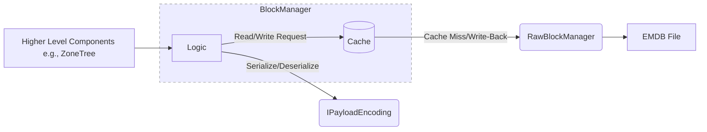

# Block Storage Architecture

This document details the components responsible for managing block storage within the EMDB file format: the `RawBlockManager` and the `BlockManager`.

## 1. Raw Block Manager (`RawBlockManager`)

### Responsibilities

-   Direct interaction with the physical EMDB file(s)
-   Reading and writing complete blocks with headers, payload, and footers
-   Managing block locations and maintaining an in-memory index
-   Validating block integrity using CRC32 checksums
-   Handling file-level operations like compaction and scanning
-   Ensuring thread-safe access through reader-writer locks

### Interface (Conceptual)

```csharp
interface IRawBlockManager
{
    Task<Result<Block>> ReadBlockAsync(long blockId, CancellationToken cancellationToken = default);
    Task<Result<BlockLocation>> WriteBlockAsync(Block block, CancellationToken cancellationToken = default);
    Task CompactAsync(CancellationToken cancellationToken = default);
    IReadOnlyDictionary<long, BlockLocation> GetBlockLocations();
    Task<List<long>> ScanFile();
}
```

### Key Characteristics

-   **Block-Aware:** Understands the complete block structure including magic numbers, checksums, and format
-   **Thread-Safe:** Uses AsyncReaderWriterLock for safe concurrent access
-   **Stateful:** Maintains block location index and current file position
-   **Recovery-Capable:** Can scan files to rebuild block location index

## 2. Block Manager (`BlockManager`)

### Responsibilities

-   Acts as an intermediary between higher-level components (like `ZoneTree`) and the `RawBlockManager`.
-   Understands the defined structure of a "Block" (e.g., Header + Payload). The header might contain metadata like block type, payload size, checksums, compression flags, etc. (Refer to `EmailDB_FileFormat_Spec.md`).
-   Serializes/Deserializes the *payload* portion of a block using a specific `IPayloadEncoding` implementation (e.g., Protobuf, JSON).
-   Constructs the full raw block (Header + Serialized Payload) before passing it to the `RawBlockManager` for writing.
-   Parses the raw block received from `RawBlockManager` during reads, separating the header and deserializing the payload.
-   **Manages block caching:** Implements read caching (keeping frequently accessed blocks in memory) and write caching/write-back caching (delaying writes to disk, coalescing multiple updates to the same block) to optimize performance and reduce disk I/O.
-   Handles block-level integrity checks (e.g., validating checksums stored in the header).

### Interface (Conceptual)

```csharp
// Assumes a generic Block<T> structure
interface IBlockManager
{
    Result<Block<T>> ReadBlock<T>(BlockLocation location);
    Result<BlockLocation> WriteBlock<T>(BlockType type, T payload);
    // Potentially methods for updating blocks, deleting blocks, etc.
}
```

### Dependencies

-   `IRawBlockManager`: To perform the *actual* file I/O when the cache needs to read from or write to disk.
-   `IPayloadEncoding`: To handle the serialization/deserialization of the block's payload before caching or after retrieval from cache/disk.
-   *(Internal Cache Implementation):* Manages the in-memory cache data structures and eviction policies (e.g., LRU).

### Key Characteristics

-   **Abstraction Layer:** Hides the raw file I/O details from consumers like `ZoneTree`.
-   **Structure Aware:** Understands the internal layout of a block (header, payload).
-   **Payload Encoding:** Manages the conversion between application objects and their serialized byte representation.
-   **Caching:** Improves performance by reducing direct disk access for frequently used or recently modified blocks.

## Relationship



The `BlockManager` orchestrates the process, interacting with its internal cache first. On cache misses or for write-backs, it uses the `IPayloadEncoding` to handle the object data and the `RawBlockManager` to handle the file system interaction.