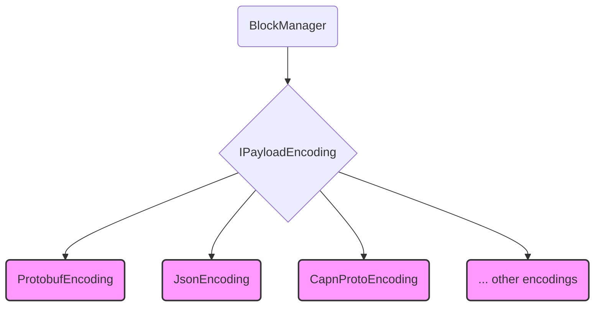

# Payload Encoding Architecture

A key design goal for the EmailDB format is flexibility in how block payloads are serialized. This allows choosing the most appropriate encoding format (e.g., for performance, size, or readability) without altering the core block management logic. This is achieved through a dedicated payload encoding interface.

## `IPayloadEncoding` Interface

The core of this flexibility lies in an interface, conceptually named `IPayloadEncoding`.

### Responsibilities

-   **Serialize:** Convert an in-memory object (`T payload`) into a byte array (`byte[]`) representation.
-   **Deserialize:** Convert a byte array (`byte[]`) back into its corresponding in-memory object (`T payload`).

### Interface (Conceptual)

```csharp
interface IPayloadEncoding
{
    Result<byte[]> Serialize<T>(T payload);
    Result<T> Deserialize<T>(byte[] data);
    // Could potentially include methods to indicate supported types
    // or provide format-specific metadata if needed.
}
```

## Integration with `BlockManager`

-   The `BlockManager` is configured (likely via dependency injection during instantiation) with a specific implementation of `IPayloadEncoding`.
-   When `BlockManager.WriteBlock<T>` is called:
    1.  It receives the payload object (`T payload`).
    2.  It calls `IPayloadEncoding.Serialize<T>(payload)` to get the `byte[]` representation.
    3.  It constructs the full block (Header + serialized payload bytes).
    4.  It passes the full block to the `RawBlockManager`.
-   When `BlockManager.ReadBlock<T>` is called:
    1.  It receives the raw block `byte[]` from the `RawBlockManager`.
    2.  It parses the header to identify the payload portion of the byte array.
    3.  It calls `IPayloadEncoding.Deserialize<T>(payloadBytes)` to reconstruct the in-memory object `T`.
    4.  It returns the reconstructed `Block<T>`.

## Implementations

Concrete implementations of `IPayloadEncoding` will be created for different serialization formats. Examples include:

-   **`ProtobufPayloadEncoding`:** Uses Google Protocol Buffers for efficient binary serialization. Requires `.proto` definitions for the data structures. (e.g., in `EmailDB.Format.Protobuf` project)
-   **`JsonPayloadEncoding`:** Uses JSON serialization (e.g., `System.Text.Json` or Newtonsoft.Json). Human-readable but potentially less efficient in size and speed.
-   **`BsonPayloadEncoding`:** Uses BSON (Binary JSON) for a balance between efficiency and JSON-like structure.
-   **`CapnProtoPayloadEncoding`:** Uses Cap'n Proto for high-performance serialization. (e.g., in `EmailDB.Format.CapnProto` project)
-   *(Others as needed)*

## Benefits

-   **Flexibility:** Easily switch payload formats by changing the `IPayloadEncoding` implementation injected into the `BlockManager`.
-   **Decoupling:** The `BlockManager` and higher layers (`ZoneTree`, `EmailManager`) don't need to know the specifics of the serialization format being used.
-   **Testability:** Allows testing components independently with mock or specific encoding implementations.



The `BlockManager` depends on the `IPayloadEncoding` interface, and a concrete implementation (like `ProtobufEncoding`) is provided at runtime.